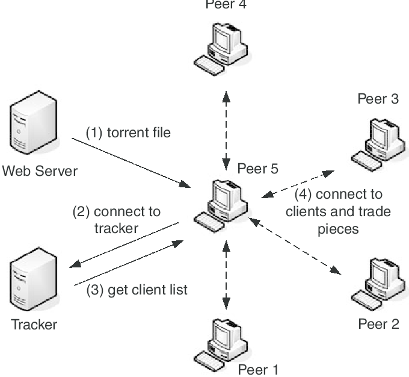
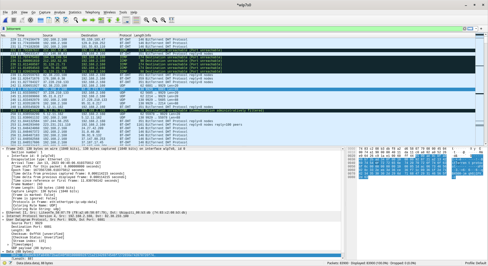
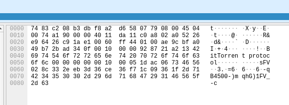
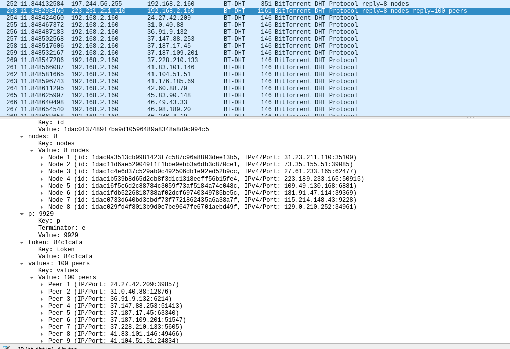
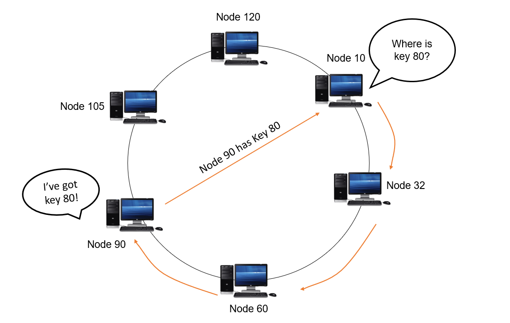
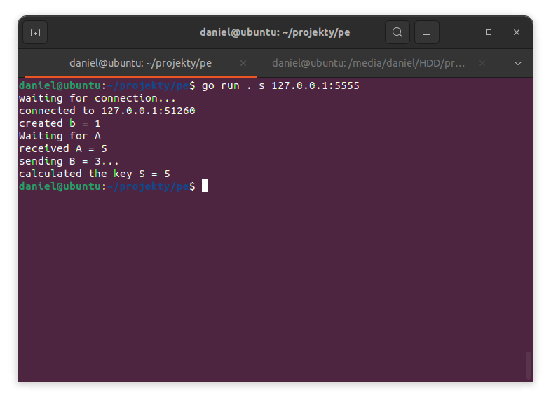
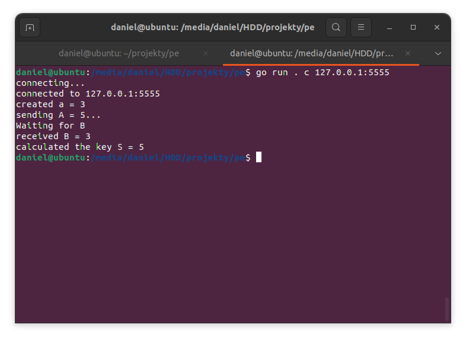

## Project plan

The personal project in this specialization is not strictly tied to our personal track. Therefore, I have decided to investigate security issues
of the BitTorrent peer-to-peer file sharing network. I have always found torrents interesting, and I believe it is a good exercise for this semester
to look at file sharing from a security perspective. Since BitTorrent was initially created in 2001, a lot of things in the world of computer security
have changed. The protocol's  security has remained fairly the same throughout the years, so I want to explore what and how could be changed in the
specification.

I want to use the Go programming language for experimenting with the protocol. The language is becoming more and more popular in the industry, because
of it's small learning curve, automatic garbage collection and speed. Therefore, I will try to use Go in different use cases to discover the potential
of the language.

### Research questions

In order to structure the learning process, I have defined a the main research question that represents the goal of the project and a set of sub-questions
that are going to help me to achieve this goal.

**How could the security of the BitTorrent protocol could be improved?**

- What are the main security concerns of the BitTorrent protocol?
- What risk is associated with using a distributed hash tables?
- How to address the lack of encryption in the protocol?

### Research strategies

In order to compute an answer for the main research question, each sub-question needs to be researched. To do that I am going to use different research
strategies from the DOT framework.

**How could the security of the BitTorrent protocol could be improved?**

- **What are the main security concerns of the BitTorrent protocol?**

  This question is focused on learning about the internals of the BitTorrent protocol. The protocol has been developed in 2001, but it lacks some of the features that
  are crucial for modern network infrastructures. I will approach this research question by applying the Library research to learn about the protocol. To get some
  hands-on experience, I will combine the Library and the Workshop strategies by learning about the protocol and experimenting with it. That way, it might be easier
  for me to visualize security holes.

- **What risk is associated with using a distributed hash table?**

  This question tries to analyze the de-facto standard of peer discovery: distributed hash tables. The hash tables can be used for trackerless peer discovery, making
  the network completely decentralized, but they also introduce some threats for the DHT nodes. I will try to answer this question by analysing the need for DHTs using
  the Library research strategy. Then, I will combine the Lab and Workshop strategies to try and come up with proposals to fix the vulnerabilities.

- **How to address the lack of encryption in the protocol?**

  The protocol is an old standard, which was built on plain TCP and HTTP. This means that the traffic between nodes in completely unencrypted and could be easily sniffed
  upon. I want to try and come up with recommendations for implementing encryption in crucial interfaces of the protocol. To do that, I would need the Library research on
  finding current encryption standards and then providing the recommendation on how it could be applied in the protocol.

### Project management

In order to efficiently work on the project, I have decided to use Scrum framework for planning and management. I split the semester into three 3 week long sprints:

- Sprint 1 - 03.10 - 24.10
- Sprint 2 - 24.10 - 14.11
- Sprint 3 - 14.11 - 05.12
- Sprint 4 - 05.12 - 12.01.2023

## What are the main security concerns of the BitTorrent protocol?

The first major peer to peer (P2P) network implementation was Napster. Napster created a network in which users could share files with each other directly instead
of having to access a website that hosted files. This was really convenient for internet pirates as websites with pirate media were quickly taken down for
copyright reasons. However, Napster had a big problem with speed. It was 1999 when the application was created, so the dial-up modems were still very much in use.
The main idea of the application was to enable sharing files by connecting directly to another peer in the network and downloading the whole file. In the most
optimistic case, a client could choose the peer with the best connection and then download the file, but that was not the case in most of the situations;
downloading an mp3 file could take around 20 minutes (if not more). Therefore, the BitTorrent protocol was created.

### How does it work?

The BitTorrent protocol worked on a basis of splitting up files into multiple parts and the redistributing them across the network of peers that are interested
in this file; either downloading or *seeding* (sharing the file with other peers). When downloading a file, the peer begins to share the downloaded parts with other
peers of the network. That way, instead of downloading a piece of data from one computer, it is obtained from many peers at once. Not only it is faster than Napster,
but also creates a decentralized network that becomes faster the more peers are taking part in it.

|  |
| BitTorrent network diagram |

To participate in the network users need to use a program that implements the protocol, so unlike Napster, the protocol allows for custom implementations. Then,
if a user wants to download a file, they need to use a torrent sharing server. From that server, users will obtain a torrent file or a magnet link, containing
the information about a *tracker* server that will be used by their BitTorrent client to get the list of peers, parts of the file, size, name etc. This allows
for almost completely decentralized file sharing network.

### Encryption

The main problem with the protocol is the lack of encryption. The concept was created back in 2001, when encryption of network communications was not the main
priority of protocol designers, as the amount of cyber attacks was much lower than in 2022. However, even today the protocol is not using encryption and it
does not seem that anything is going to change about it soon.

|  |
| Wireshark capture |

|  |
| Handshake |

Wireshark has a built in BitTorrent protocol support, so the filter can be easily applied to the capture. As you can see in the *Handshake* image, the protocol
handshake was intercepted. The message was sent in plain text, just as the response with the list of peers:

|  |
| Peers |

This is what makes the protocol very unsecure: virtually anybody can sniff on the network and get a list of IP addresses and the ports they are listening to. It
can be used for disclosing the torrenting computers on a massive scale or exploiting that in some different way. Apart from disclosing the IPs, lack of encryption
makes it much easier for man in the middle attacks. A hacker could implement the protocol easily and then announce himself as the router in the network and capture
only the BitTorrent related packets. Then, they would be able to give any kind of response to the users and possibly send their malware instead of the original
files.

## What risk is associated with using a distributed hash table?

As shown on the diagram with the BitTorrent architecture earlier, the network is actually not really decentralized. Peers are communicating with each other
without middlemen, but peer and file discovery is still bound to trackers and servers running the index of files. Therefore, BitTorrent decided to implement
a technology called a [Distributed Hash Table](https://en.wikipedia.org/wiki/Distributed_hash_table) (DHT).

So what is DHT? Essentially its a hash table that is stored on many clients in the network. Each node in the DHT has a record of peers of nearby peers
(not location-wise, but rather close to its DHT address). That, combined with sophisticated routing functions allow users for efficient key:value lookup.
In BitTorrent's implementation, the data stored are the pieces of files uploaded to the network. The main advantage of DHT, unlike blockchain, is that
each node only has information about its predecessor, so every time a node is inserted or removed from the DHT, it does not affect the structure of the
whole network. To simplify the concept, DHTs could be though of as double linked-lists, which is illustrated by the following diagram:

|  |
| [DHT lookup](https://steffikj19.medium.com/dht-demystified-77dd31727ea7) |

### Spying and searching

However, this design has a security flaw which is often used to discover peers sharing copyright claimed data. The talk
[Crawling DHTs for fun and profit](https://www.youtube.com/watch?v=v4Q_F4XmNEc) at DEFCON18 references a research papre
[Spying the World from Your Laptop](https://www.researchgate.net/publication/45910450_Spying_the_World_from_your_Laptop_--_Identifying_and_Profiling_Content_Providers_and_Big_Downloaders_in_BitTorrent).
In essence, the researcher talks about how he has developed a DHT searching engine through the means of crawling. One implementation of the DHT provided
torrent file description which could be retrieved in plain text. With that knowledge, he was able to query the whole DHT (thousands of nodes) to look for
certain files. The results he got were lists of peers that had pieces to the files that he was looking for.

This mechanic of the system is often abused for copyright claims since it allows virtually anyone to get a list of peers that have the parts of the file.
Apart from copyright claims, this can be used by blackhats that want to conduct, let's say, a DDOS attack if a vulnerability in a BitTorrent client is
found or just harvest some data from the users.

### Sybil attacks

Another attack that could be launched on the DHT is a [Sybil](https://en.wikipedia.org/wiki/Sybil_attack) attack. Named after a case study of a woman
named Sybil, which had dissociative personality disorder, it works by creating multiple identities on a single machine so that attackers can gain 51%
of presence in the network. If somebody controls the majority of a peer to peer network stopping them might be virtually impossible. The consequences
can be severe, since the attacker could distribute malicious files pretending to send legitimate data.

One way to prevent Sybil attacks is to make creating new identities hard for the attacker. Joining the network could require providing an email address,
a telephone number or creating a new account in some system. However, the [BitTorrent specificatoin](http://www.bittorrent.org/beps/bep_0003.html) does
not specify any kind of personhood checks.

All together, the DHT is a great way to store large amounts of data without the need of centralization, however it has security holes that could affect
hundreds of thousands users with quite low effort attacks.

## How to address the lack of encryption in the protocol?

I want to focus on the results of the first research question and investigate why there is no encryption in the protocol and how to address the issue.
[Encryption of the protocol](https://en.wikipedia.org/wiki/BitTorrent_protocol_encryption) was a topic of many discussions for a long time. According
to Briam Cohen, the protocol creator, encryption would make the network perform worse. He bases his statement on the fact that ISPs detect the protocol
and increase the bandwidth of network. Because this is not a low-level protocol, encryption would make identifying the packets much harder.

These days, most ISPs are throttling down the network capacity if they detect BitTorrent file sharing or even try to issue copyright claims on users
since they know exactly what is in the packets. I wanted to see if it was possible to use the protocol over an encrypted channel using the HTTPS
approach, which relies on the [Diffie-Hellman key exchange](https://www.youtube.com/watch?v=NmM9HA2MQGI).

### Implementing the key exchange

Diffie-Hellman is based on prime numbers, as majority of cryptographic protocols. The exchange could be broken down into the
[following steps](https://exercism.org/tracks/go/exercises/diffie-hellman)

1. The program provides two generator number `p` and `g`
2. Alice picks private number `a` which `1 < a < p`, Bob does the same with `b`.
3. Alice calculates her public key A with `A = g^a mod p`, Bob does the same for B with his secret
4. The public keys are exchanged and Alice calculates the secret key S with `S = B^a mod p` and Bob does the same with `A` and `b`
5. Now, they both have a symmetric key which will be used for encryption

Diffie-Hellman does not provide that much security as other protocols, but it is used for establishing a secure channel that is
almost unfeasible to break. For the implementation I have deliberatly chosen small numbers for `p = 11` and `g = 3`, as computers
are known to mess up bigger numbers. Taking care of that would require too much effort for the scope of the project.

This is the code for the `client` or the peer that will initiate the connection:

```go
// create a
rand.Seed(time.Now().UnixNano())
a := rand.Intn(p-1) + 1
fmt.Printf("created a = %v\n", a)

// calculate and send A
A := math.Mod(math.Pow(float64(g), float64(a)), float64(p))
fmt.Printf("sending A = %v...\n", A)
sendPk(A, conn)

// wait for B
println("Waiting for B")
B := getPk(conn)
fmt.Printf("received B = %d\n", B)

// calculate S
return math.Mod(math.Pow(float64(B), float64(a)), float64(p))
```

And this is the code for the `server` or the peer that will serve the client:

```go
// create b
rand.Seed(time.Now().UnixNano())
b := rand.Intn(p-1) + 1
fmt.Printf("created b = %v\n", b)

// listen for A
println("Waiting for A")
A := getPk(conn)
fmt.Printf("received A = %v\n", A)

// calculate and send B
B := math.Mod(math.Pow(float64(g), float64(b)), float64(p))
fmt.Printf("sending B = %v...\n", B)
sendPk(B, conn)

// calculate S
return math.Mod(math.Pow(float64(A), float64(b)), float64(p)
```

When I ran the code I saw that it worked successfully:

|  |
| Server |

|  |
| Client |

### Encrypting communication

So now, that the key exchange is working, it is time to try and encrypt communication between the two parties. To do that,
I will use the AES cypher. First, I wrote an utility function that will take the secret number, and create an AES key
