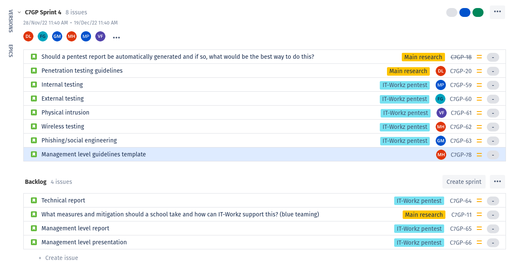

The goal of this learning outcome is to show that I can work on a complex project with minimal guidance from the teachers, and be able
to show the outcomes of my research with the stakeholders and my peers. The research needs a clear goal and an approach that I will use
to achieve this goal. Then, by combining different and appropriate research strategies I need to be able to reach that goal and produce
a solution that can be verified by involved stakeholders.

## Group project at IT-Workz

My group project was an assignment at IT-Workz - a company that mainly on delivering IT infrastructure solutions to their clients (mainly
educational institutions). The company's expertize was in the defensive side of IT security. They strived to create secure and durable
systems and now they wanted to extend their field of expertize to penetration testing. That way, they could test already existing solutions
and provide accurate feedback of what and how should be fixed.

Therefore, IT-Workz tasked us with conducting a penetration test in an external company. They wanted us to use the results of the assessment
and knowledge from other sources to create a set of best practices, guidelines and procedures needed for penetration testing, reporting and
risk analysis. The desired deliverables were two documents: one for the management and one for the technical staff, that could be used as a
reference during future talks with clients and while executing pentests respectively.

### Goals and the scope

After the initial talks with the company, we have decided on the scope of the project: a pentest at an external company with a report,
two documents with procedures and guidelines for providing penetration tests as a service and a research (possibly with proof of concept)
on how to automate reporting of penetration tests.

The most important part for IT-Workz was to provide them with guidelines for penetration testing for their technical and management
personnel. The automated reporting was still a big point of interest, but they were mainly curious if that could be possible, and
did not expect a finished product from our team.

Having received the business requirements from the product owners, our group has proceeded to define the relevant research question and
its sub-questions, followed by establishing the required strategy (or more) to answer each of them.  However, the main research question
was: **How can IT-Workz ensure that a pentest can be provided as a service?**, with the sub-questions focusing on:

- What are the security needs of educational institutions?
- What are other companies offering and how can IT-Workz compete with that?
- What are the required skills and tooling for pentesting?
- What should a pentest report contain and can the process be automated?

You can find more about the research questions in my
[group project research description](https://malpa222.github.io/portfolio/group/description#research-questions).

### Organizing research and development

Majority of the research questions were based on the Library research with focus on the Literature study. However, the questions
that used the input from the Hoefnagels pentest, had to use the Field research alongside with the Literature. All of the goals
of the project were validated with our peers and teachers using the Showroom strategy in meetings, presentations and in demos.

Apart from the DOT Research Framework, we have used the Unified Kill Chain and Mitre ATT&CK methodologies for choosing the best
techniques and applying them to relevant phases of the penetration test. Furthermore, with the help of the CIA Matrix, we were
able to conduct a risk analysis at Hoefnagels.

Compared to the previous cybersecurity project I did, this time we have took more research oriented approach and based our plan on
reaching the goal that clients wanted. Last time, our project was mainly focusing on performing a pentest, and proposing a secure
solution but the we did not pay as much attention to the outcome as to the process.

### My activities

In the group I took the role of the Scrum master. I was responsible for overseeing the issue management in our team and tracking our
performance from sprint to sprint. After creating the research questions, we put them in Jira tickets and assigned them to epics that
grouped the similar sub-questions or tasks.

|  |
| Group project backlog |

Apart from project management, during the research and development I was focusing on the social engineering techniques and explaining
different types of pentests.

- Social Engineering

    Together with Georgi Minchev, we have conducted a phishing campaign on Hoefnagels employees. We have aimed to test employees
    awareness rather than ourt ability to breach through the security measures. Then, I have described the requirements for such
    tests in both technical and management level guidelines. You can find my writeup in the
    [Hoefnagels Social Engineering section](https://malpa222.github.io/portfolio/handson/hoefnagels).

- Penetration test types

    In our deliverables for IT-Workz, each of us was tasked with writing a set of guidelines about a chosen aspect of penetration
    testing. I decided to write about the different approaches to pentests: white, black and gray box. The goal was to explain
    what kind of knowledge, resources and approach is required so that both technical and management staff can efficiently propose
    the approach to a client.

## Reflections and evaluation

Throughout the project our group was involved in a lot of different activities. I worked on the phishing attacks and my teammates
were conducting physical intrusion activities or the wireless attacks. I am however very satisfied with my tasks since I got a
chance to learn about social engineering and gain hands-on experience. This knowledge is very valuable, because there is almost
no controlled environment for learning social engineering in practice without testing it on actual people, which is unethical.

For me, the biggest challenges in the project were organizational and technical. First of all, communication with IT-Workz was
very cumbersome. Even though our team stayed proactive all the time, the company was very slow to respond, which significantly
hindered our progress, making it impossible to conduct more than one pentest. However, we kept the teachers up to date with the
progress of the project. Another big challenge was technical - phishing is very hard in modern internet. First, our phishing
website was flagged by (possibly Google's) web crawlers and flagged, so we had to start from the beginning. Then, setting up
the DNS forwarding and mail servers was also hard, since we didn't have enough time to make our mailing service authentic.
More details can be found in the [Hoefnagels phishing writeup](https://malpa222.github.io/portfolio/handson/hoefnagels)

Looking back at the project, I can say that we could have definitely improved how we split the tasks among each other. While
I got pretty good tasks, I think that the size of our group was inadequate to the tasks that we created. For example, during
a pentest, it seemed that there were too many people trying to exploit the Hoefnagels infrastructure, which made the work a
bit chaotic. Nevertheless, I can take out an important lesson out of it - more people does not always mean that the work will
be faster. It will definitely help me in my professional career where I will have to work with other people.
