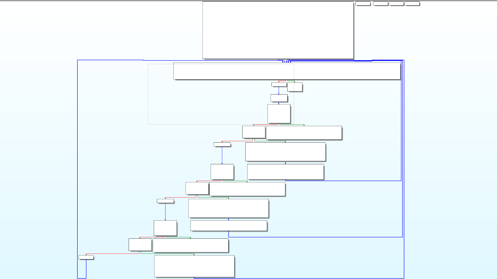

This document is a follow-up on the trends research, precisely on the topic of cross-platform malware. Since virtually everybody in the western world owns a smartphone
or a personal computer, the amount of different platforms that are running on our hardware is bigger than it ever was. This forces malware developers to spend much more
time on creating malware for each of these systems.

Nowadays, with the rise of new systems programming languages such as Rust or Go, developing malicious software for different platforms has become more accessible
and much quicker than it ever was.

## Research questions

Because portable software is a broad subject, I have decided to only focus on some key parts of the domain. My research will try to answer the following question,
along with the sub-questions:

**How can LLVM compiler infrastructure be used to aid malware development?**

- Why would a malware developer choose Rust over C/C++?
- How does programming in Rust affect static analysis?
- Why would a malware choose to work with languages using LLVM-based compilers?

### Research strategies

In order to answer the sub-questions and produce the conclusion of the research I will combine different research strategies. This approach is going to allow me
to structurize my work and validate the quality of my research.

- **Why would a malware developer choose Rust over C?**

    This research questions will require the combination of Library, Workshop and Lab strategies. I will use Library to research what are the most important aspects of
    language used for malware development. Then, I am going to use that knowledge in the Workshop, to develop the software and validate it in the Lab. The results
    from the Workshop are going to have the biggest impact on the answer of this research question.

- **How does programming in Rust affect static analysis?**

    Static analysis is a primary technique for dissecting and analysing malware samples. To research how Rust might change the the reverse engineering process, I will
    need to do some Library research on differences between Rust and C compilation process. Then I will take my findings to test in the Lab and the Workshop by reverse
    engineering a C program and its Rust counterpart.

- **Can the compilation process of the LLVM based compilers be used for malware development purposes?**

    Rust is a very recent case of a programming language built on the LLVM toolchain. However, this is not the only one. Many programming languages are built using the
    LLVM toolchain. The framework allows for a lot of flexibility and is very modular. Therefore, I want to investigate how it works and how it can be used by the malware
    developers.

Having researched all the sub-questions I would be ready to produce the answer to the final question. To do that, I need to use the product of the research in the Lab
to see if and how does it work and then present it to my peers in the Workshop strategy.

## Why would a malware developer choose Rust over C/C++?

Malware development has always revolved around writing low-level code that interacts closely with a kernel of an OS. Linux kernel is written in C and Windows kernel in
C++. This means that majority of the malware developed throughout the years has been written in C or C++, since it allows for the best compatibility with native APIs.
According to _[Malpedia](https://malpedia.caad.fkie.fraunhofer.de/stats/linker_info)_, majority of viruses in their database are using MSVC linkers which suggests that
the software was written in languages from the C family, developed directly on Windows.

|  |
| Linkers used for compiling malware |

However, as of writing this document, the landscape begins to change. According to _[this article](https://www.zdnet.com/article/linus-torvalds-rust-will-go-into-linux-6-1/)_
and _[Rust for Linux](https://en.wikipedia.org/wiki/Rust_for_Linux)_ Wikipedia page, a pull request enabling Rust support has been merged into the kernel in October 2022.
This means that from Kernel v6.1, developers can officialy start writing drivers in Rust. Ultimately, this means that interoperability with C and other system internals
is going to become much better.

But why would a malware developer choose Rust over C? There are couple of the most prominent benefits:

- **Speed and memory safety**

    The Rust project has been started around a decade ago as a part of the Firefox browser. The language operates on lower level as C/C++ but has a different approach
    to some concepts that C-like languages were historically struggling with. There is no automatic garbage collection; instead, the lifetime of each variable is tracked
    during the compile-time. This approach can catch more memory corruption bugs during early stages of development.

    Moreover, Rust can compete with C/C++ in memory and speed benchmarks, while providing access to higher level programming concepts as closures, generics and collections
    as zero-cost abstractions.

- **Static analysis evasion**

    As stated before, majority of the malware in existence has been developed using C/C++. This means that for years, security researchers have used and developed software,
    that helps with analysing C/C++ binaries. However, Rust is not using a traditional compiler, but LLVM - a frontend, which provides a layer of abstraction beetwen the
    language and the machine. This benefits both regular and malware developers: the code is faster, and can be obfuscated more easily.

    It is significantly harder to statically analyze a Rust program since the compiler injects memory leakage checks into the binary during the compilation process. Resulting
    file is slightly bigger beacuse it contains much more machine code. This means that the readability of the executable is low in the first place and obfuscation introduces
    even more entropy into the file.

- **Cross-platform compatibility**

    The language was designed to work on _[multiple platforms](https://doc.rust-lang.org/nightly/rustc/platform-support.html)_ without rewriting the whole codebase or going
    through a complex compiling process (mainly thanks to LLVM). Moreover, Rust has quite good support for embedded devices, and it is possible to compile a program without
    the whole standard library. That makes the executable much smaller which is always desired by malware developers.

### Conclusions

Rust has some new approaches to common programming concepts which have been causing problems for many years. Because of that, and its low-level nature it seems like a great fit
for malware development: zero-cost abstractions for high-level concepts, speed on a C/C++, a compiler catching memory leaks in the development and a lot of freedom and flexibility
for creating viruses for different systems and devices.

This does not come without a cost - the learning curve is very steep in the beginning only to become more gradual after the initial barrier. This makes the first-time development
a long and cumbersome task. Also, the compile times can be very slow, especially for bigger projects, since the compiler is running a borrow checker which tracks a lifetime of every
variable in the program.

## How does programming in Rust affect static analysis?

There are two main types of malware analysis: dynamic and static. Dynamic analysis tries to inspect a malware sample by running it (usually in a sandboxed environment). The main
advantage of this approach is the ability to attach a debugger to the process and to take a closer look at the program during the runtime. The static analysis however relies on
inspecting and reverse engineering the compiled executable without running it. This process can reveal execution flows and hidden data which would not be accessible during the
runtime.

Therefore, apart from creating the logic for malware, the developers need to account for the fact that their software will be analysed by security researchers. This is not desired,
since the less is known about a malware, the higher the chance that it will sneak under AVs and will manage to infect more users. While avoiding dynamic analysis is more or less
the same in C and in Rust, the biggest differences can be seen in the static analysis part of reverse engineering.

### Syntax sugar and macros

Because Rust is a modern language, it tries to make low-level development easier for the programmer. It uses a lot of high-level programming concepts such as anonymous
functions, iterators, generics etc. Moreover the language has a big support for macros, which make meta-programming a bit easier for the developers. Another big feature of
the language is the novel approach to memory management. The compiler has a borrow checker - a tool that tracks the lifetime of each variable to ensure that there will be
no memory leakage in the code. Such amount of high-level and complicated concepts requires a lot of syntax sugar, and hiding the 'guts' of the language away from the
programmer.

Let's take a look at a simple program that iterates over an array and prints its contents:

```rust
let arr = vec![1, 2, 3]; // vec! is a macro that creates a vector

for num in arr {
    println!("{}", num); // println! is a macro that prints to stdout
}
```

The macros and the for loop are actually a sugar coating for a more elaborate control flow which is expanded during the compile time.

```rust
// expansion of the vec! macro
let arr = <[_]>::into_vec(#[rustc_box] ::alloc::boxed::Box::new(["1", "2", "3"]));

// for loop is actually a syntax sugar for
// an infinite loop based on iterators
let mut iter = IntoIterator::into_iter(arr);
loop {
    match iter.next() { // match the next iterator
        Some(num) => {
            {
                // expansion of the println! macro
                ::std::io::_print(
                    ::core::fmt::Arguments::new_v1(
                        &["", "\n"],
                        &[::core::fmt::ArgumentV1::new_display(&num)],
                    ),
                );
            };
        },
        None => break, // break if 'empty'
    }
}
```

It's not important to understand what the code does but rather to notice how many statements were expanded by the compiler during the build process. The for loop is an infinite
loop that has a hidden conditional flow, and `vec!` and `println!` macros are handy shortcuts that allow the programmers to delegate some work to the compiler instead of
worrying about the type safety.

### Borrow checker and static analysis

The flagship feature of the language is the borrow checker. The borrow checker is embedded in the compiler and it changes the way the developers work with the memory of
the program. Instead of manually allocating and freeing up the memory for variables, the compilers assigns ownership to them. That way, there are no 'dangling pointers' in
which can lead to memory leakage or corruption (usually).

This is a complex process that makes the compiler inject a lot of code into the program, to facilitate memory management. This results in a lot of machine generated code
that makes no sense at first and really inflates even a simple program. Take this implementation of 'FizzBuzz':

```rust
fn main() {
    for i in 0..100 {
        if i % 15 == 0 {
            println!("fizzbuzz");
        } else if i % 3 == 0 {
            println!("fizz");
        } else if i % 5 ==  0 {
            println!("buzz");
        }
    }
}
```

After compiling it with `cargo build --release` and decompiling the resulting binary, IDA presents this graph:

|  |
| Program disassembly |

The resulting graph is very huge, and seems too big for the amount of instructions we wrote in our program. This is mainly due to the borrow checker injecting boiler plate code.

### Compilation process

LLVM is a set of compiler and toolchain technologies that can be used for developing programming languages. The main advantage of using LLVM comes from using it as a front-end
of the programming language. In essence, this means that LLVM performs code analysis and transforms it into a bytecode which can be compiled by any compiler. In a way, this makes
the Rust compiler platform agnostic.

A compilation process consists of these steps:

1. Lexical analysis
2. Parsing
3. Semantic analysis
4. Optimisation
5. Code generation

Lexical analysis creates so called `tokens` which are then processed by the parser to build abstract syntax tree. At the parsing  stage, the compiler expands macros and de-sugars
the code. So the following instructions:

But how all of this relates to the static analysis?

### Optimization passes

After desugaring and lexing, LLVM produces a `.ll` file, which contains bytecode referred to as _Intermediate Representation_ (IR). This file can be then compiled with any LLVM compatible
backend. The nature of LLVM allows developers to write passes that will process the IR. This can be leveraged by malware developers to obfuscate the executables. LLVM documentation provides
a guide on how to write these passes

Therefore I have decided to create a simple pass that will substitute some arithmetic operations of the IR bytecode. This is just a proof of concept to show
the modularity of LLVM.

```cpp
// RandomSeed.cpp

#include "llvm/Pass.h"
#include "llvm/IR/Function.h"
#include "llvm/Support/raw_ostream.h"

using namespace llvm;

namespace {
    struct Substitution : public FunctionPass {
        static char ID;
        Substitution() : FunctionPass(ID) {}

        bool runOnFunction(Function &F) override {
            return false;
        }
    };
}

char Substitution::ID = 0;

static RegisterPass<Substitution> X("Substitution", "Instruction substitution");
```

LLVM works with C just as good as with Rust, so the plugin can be applied to both languages. This shows how easy it might be to add an obfuscation step to the
compilation process.

### Conclusions

LLVM can be used for binary obfuscation in a few different ways. One way is to use LLVM's intermediate representation (IR) to transform the program's code in a way that makes it 
more difficult to understand. The IR can be used to rename variables and functions, reorder code blocks, or insert additional code that has no effect on the program's behavior. 
By using LLVM as a common framework for these techniques, it is possible to create complex and effective binary obfuscation strategies.

And with Rust's native support for LLVM, a team of skilled malware developers can really increase their chances of making their program 'irreversible'

## How does Rust's binary portability relate to modern malware development?

Binary portability is an ability of program to run on different platforms without requiring any modifications. To achieve cross platform portability, the program must be written in a
language that compiles to platform-agnostic bytecode. Rust uses LLVM for that, which means that the LLVM's IR can be then easily compiled for any platform, as described in the previous
section. Moreover, with `rustc`, a frontend for LLVM, programmers can compile code for different platforms and/or processor architectures by supplying one additional flag to the command:
`--target`. This allows building code for platforms that developers don't have access to.

In November of 2021, first samples of the BlackCat


### Something more complex

Because this obfuscation pass is a very small change, the compiler would still optimize the code (unless you have a custom clang build). However, more complex
obfuscation techniques, such as [control flow flattening](http://ac.inf.elte.hu/Vol_030_2009/003.pdf). In essence, this technique breaks down the body of a
program and putting it into a `switch ... case` statement. Then, using a dispatcher variable, the each block decides on the next set of instructions.
