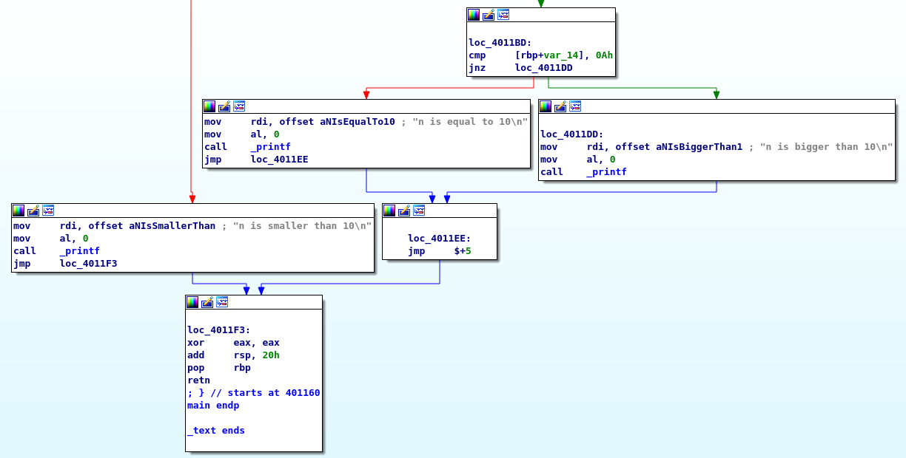
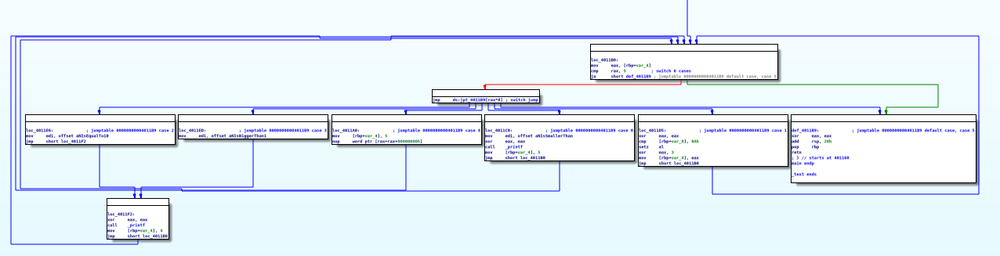

This document is a follow-up on the trends research, precisely on the topic of cross-platform malware development. Since virtually everybody owns a smartphone
or a personal computer, the amount of different platforms that are running on our hardware is bigger than it ever was. This forces malware developers to spend
much more time on creating malware for each of these systems.

Nowadays, with the rise of new systems programming languages such as Rust or Go, developing malicious software for different platforms has become more accessible
and much quicker than before. I want to investigate why developers would choose cross-platform toolchains and how the technologies could be leveraged for malware
development purposes.

## Research questions

Because cross-platform development is a very broad subject, I have decided to only focus on some key parts of the domain. My research will try to answer the
following question, along with the sub-questions:

**How can LLVM compiler infrastructure be used to aid malware development?**

- Why would a malware developer choose an LLVM based language?
- Are plugin development results worth the time spent learning the LLVM infrastructure?
- How effective is the control flow flattening obfuscation?

### Research strategies

In order to answer the sub-questions and produce the conclusion of the research I will combine different research strategies. This approach is going to allow me
to organize my work and validate the quality of my research.

- **Why would a malware developer choose a language built on LLVM?**

    I need to find out what are the most commonly used languages for malware development and what are the most important characteristics of such language.
    Then, I will try to research whether an LLVM-based language might be a good choice. Therefore, the first research question will mainly require using the
    Library strategy.

- **Are plugin development results worth the time spent learning the LLVM infrastructure?**

    Using the input from the previous research question, I want to build on it to find out how to create my own plugin that will aid malware development,
    especially the obfuscation part. To find an answer I will need to rely on the Workshop research strategy to develop the addon and try to connect it
    to the rest of the framework. This will give me an overview of the learning curve and the value of the knowledge.

- **How effective is the control flow flattening obfuscation?**

    After investigating the compilation process of the LLVM based compilers, I will create a proof of concept software that will put the LLVM's possibilities
    to the test. The goal is to try and implement the control flow flattening algorithm in the LLVM optimization pipeline to make reverse engineering harder.
    This will require Library research for learning about the algorithm and then Lab and Workshop for implementing and testing the results.

Having researched all the sub-questions I would be ready to produce the answer to the final question. To do that, I need to use the product of the research in
the Lab to see if and how does it work and then present it to my peers in the Workshop strategy.

## Why would a malware developer choose a language built on LLVM?

Malware development has always revolved around writing low-level code that interacts closely with a kernel of an OS. Linux kernel is written in C and Windows
kernel in C++. This means that majority of the malware developed throughout the years has been written in C or C++, since it allows for the best compatibility
with native APIs. According to [Malpedia](https://malpedia.caad.fkie.fraunhofer.de/stats/linker_info), majority of viruses in their database are using MSVC
linkers which suggests that the software was written in languages from the C family, developed directly on Windows.

|  |
| Linkers used for compiling malware |

In November of 2021, first samples of the BlackCat ransomware were noticed by security researchers. BlackCat is a malware family that's written in Rust. The
main benefit of that language is memory safety, ease of development and most importantly cross-platform compilation. Because the language is built using the
LLVM compiler toolchain, it is very ease to compile it to a CPU with a different instruction set. This event showed that Rust and LLVM as a choice for malware
development are starting to gain traction.

LLVM facilitates cross-platform compilation by slightly altering the standard compilation process. In essence, the code is translated to an abstract assembly
language, which is then compiled to the specific CPU architecture. This intermediate language allows developers to create plugins that can 'optimize' the
intermediate representation (IR) to make it run faster for example.

| ](../../assets/img/indepth/LLVMCompiler1.png) |
| [LLVM's three phase design](http://aosabook.org/en/llvm.html) |

Let's look at an unoptimized piece of the intermediate representation. It was generated by the `clang` compiler, and I just made it a bit more readable. The
code shifts variables around loads them and pops them from the stack, but it could be much simpler. More information on each instruction can be found in the
[IR reference](https://llvm.org/docs/LangRef.html).

```llvm
define @add(i32 %a, i32 %b) {
    ; allocate 4 bytes on stack for %c and %d
    %c = alloca i32, align 4

    ; store %a and %b in %c and %d
    store i32 %a, ptr %c, align 4
    store i32 %b, ptr %d, align 4

    ; load %a and %b into %e and %f
    %e = load i32, ptr %3, align 4
    %f = load i32, ptr %4, align 4

    ; add %e and %f, store in %g
    %g = add i32 %e, %f
    ret i32 %g
}
```

So we could write a plugin that would optimize the `add` function into a much simpler piece of code:

```llvm
define i32 @add(i32 %a, i32 %b) {
  %c = add i32 %a, %b
  ret i32 %c
}
```

This shows that 'optimizations' that are very beneficial for malware development could now be in the reach of developers. The plugins are written in C++ -
a language that majority of malware developers know from inside-out and use very often. Moreover, what contributes to the flexibility and the modularity of
the LLVM is its architecture. Instead of being a monolith, like GCC the framework is rather **a collection of libraries** that compose the toolchain.

This is a very powerful design feature, since developers can only pick the parts of the infrastructure they want to use instead of dealing with the whole
toolchain, following the **you don't pay for what you don't use** principle. In practice, it means that the libraries don't do anything by themselves but
it's up to the programmer to link them in preferred order.

|  |
| LLVM Optimization Pipeline |

In the picture, the `PassB.o` is referencing `PassD.o` while `PassC.o` is left out, because it was not registered in this optimization pipeline. This design
is very modular and is using a common interface for optimizing the code - intermediate representation. That way, developers can create independent parts
*out of tree*, meaning that they can create small modules which can be included without drastically changing the pipeline or without the need to learn the
whole infrastructure to accomplish a simple task. Moreover, the modularity of LLVM increases the chances that old plugins are still going to be compatible
with newer versions of the infrastructure. 

In essence, LLVM can be used in various ways and there is high chance that it will satisfy the needs of majority
of malware developers. If that is not the case, the modular design allows the programmers to implement their own extensions.

### Obfuscation as optimization

One optimization that comes to mind is automating obfuscation. Since the dawn of malware, obfuscation was usually done by hand, making the code very
hard to read and maintain. However, this is an important part of malware development, since it allows the software to avoid initial antivirus detection,
and can delay the progress of reverse engineers trying to analyze the executable. Now, with LLVM plugins, it could be done during the compilation,
lifting the burden from the programmer.

There are many different obfuscation techniques like encrypting strings, substituting instructions for more complex ones or changing the control flow
of the program. I want to focus on the latter one, since it can create powerful results with few relatively small amount of work.
[This research paper](https://ac.inf.elte.hu/Vol_030_2009/003.pdf) describes the control flow flattening obfuscation technique. In essence, the goal of the
flattening is to change the flow of the execution of a program so that figuring out what certain parts are doing will become a tedious exercise for
the reverse engineer.

|  |
| Control flow flattening |

As you can see, overall linear structure of the program was completely flattened. The program jumps between the blocks by comparing and changing value of
a **dispatcher** variable outside a `switch...case` block. See the following block of pseudo code:

```c#
original() {
    print "foo"
    print "bar"
    print "baz"
}

obfuscated() {
    var dispatcher = 1

    while (dispatcher != 0) {
        switch (dispatcher) {
            case 1:
                print "foo"
                dispatcher = 2
                break;
            case 2:
                print "bar"
                dispatcher = 3
                break;
            case 3:
                print "baz"
                dispatcher = 0 // stops the enclosing loop
                break;
        }
    }
}
```

Writing these instructions by hand results in unmaintainable spaghetti code which can be annoying even for malware developers. Moreover, it takes
a lot of time and effort to make out a sense of the program while looking for bugs or logic errors. However, using the possibilities provided by LLVM,
this could be done automatically. This type of obfuscation makes even a simple code quite hard to decipher for the reverse engineer or the antivirus
software. And with the modularity of the LLVM infrastructure, the required amount of work and the learning curve are relatively low, which is exactly
what a malware developer is looking for.

## How to develop a plugin for LLVM's optimization pipeline?

So far, the research has provided the following results - LLVM is a set of modular and interchangeable libraries that can be chained and tailored together
to achieve a specific goal in the compilation domain of a project. Such goal could be automatically obfuscating executable files produced by the compiler.
To test how it works and later produce a proof-of-concept, I want to create a simple optimization pass for substituting instructions. Later, with newly
acquired knowledge, I want to create a more complex pass that will flatten the control flow of a program.

### Out of tree development

To develop **out of tree** in LLVM lingo means to create a library, that does not need to live inside of the directories of the original project, but can
be developed independently, without being tightly coupled to the LLVM version that we are using. In 2022, it is much easier to do it this way, since the
development team created a new pass manager that allows for more decoupled pass orchestration. Throughout the next chapters I am going to refer to my
GitHub repository with the source code containing the obfuscation passes - [malpa222/llvm-obfuscation](https://github.com/malpa222/llvm-obfuscation)

My repository has three main directories where development happens:

- `include/` - contains header files of the obfuscation passes
- `lib/` - contains the implementation of the passes
- `plugin/` - registrations of passes to the plugin manager (PM)

There are two main type of passes in the LLVM world - analysis and transformation. Because they all operate on the common interface which is the
intermediate representation, results from the analysis passes can be used by the transformation passes. This is going to be helpful during the later stage
of the development. For now, I will focus on creating a simple pass that will substitute addition instructions so that `a + b` becomes `a - (-b)`.
I have split the plugin development into three stages: definition, implementation and registration/build.

#### Definition

First, I have defined the components that will make up the plugin. Since I wanted to substitute only the addition operations, I have decided to create two
passes: `SubstitutionAnalysis` and `SubstitutionPass`, where the first one will supply the addition operations to the latter.

```cpp
#include "llvm/IR/InstrTypes.h"
#include "llvm/IR/PassManager.h"

namespace substitution {
    struct SubstitutionPass : public llvm::PassInfoMixin<SubstitutionPass> {
        static llvm::PreservedAnalyses run(
            llvm::Function &F,
            llvm::FunctionAnalysisManager &FAM);
    };

    struct SubstitutionAnalysis : public llvm::AnalysisInfoMixin<SubstitutionAnalysis> {
        using Result = llvm::SmallVector<llvm::BinaryOperator *, 0>;
        Result run(
            llvm::Function &F,
            llvm::FunctionAnalysisManager &FAM);

        static llvm::AnalysisKey Key;
    };
} // namespace substitution
```

Notice how both passes are accepting the same parameters in the `run` function. That way, `SubstitutionPass` is able to get the results of the
`SubstitutionAnalysis` from the `FunctionAnalysisManager`.

#### Implementation

With the structs defined, I have proceeded to implement them in `lib/SubstitutionPass.cpp`. First I created the analysis pass, that will return
the addition instructions in the basic blocks of the IR code.

```cpp
SubstitutionAnalysis::Result SubstitutionAnalysis::run(
    Function &F,
    FunctionAnalysisManager &FAM) {
    SmallVector<BinaryOperator*, 0> Insts; // initialize the instructions vector

    for (inst_iterator I = inst_begin(F), E = inst_end(F); I != E; I++) {
        // checks if I is addition of the same types
        // e.g. int + int
        if (!I->isBinaryOp())
            continue;

        if (I->getOpcode() == Instruction::Add)
            Insts.push_back(cast<BinaryOperator>(&*I));
    }

    return Insts;
}
```

As you can see, the pass checks if the `opcode` of the instruction is addition and then appends it to the `Insts` vector. Then, the result is
consumed by the transformation pass as follows.

```cpp
PreservedAnalyses SubstitutionPass::run(Function &F, FunctionAnalysisManager &FAM) {
    auto &AddInsts = FAM.getResult<SubstitutionAnalysis>(F);

    for (auto BO: AddInsts) {
        // first negate the second operator: b -> -b
        // the last parameter tells the function to insert
        // the instruction before the BO
        auto op = BinaryOperator::CreateNeg(
                BO->getOperand(1),
                "",
                BO);

        // then, create a substitution operation
        auto sub = BinaryOperator::Create(
                Instruction::Sub,
                BO->getOperand(0),
                op,
                "",
                BO); // insert before BO

        // replace the old instruction with the new one
        BO->replaceAllUsesWith(sub);
        BO->eraseFromParent();
    }

    auto PA = PreservedAnalyses::all();
    PA.abandon<SubstitutionAnalysis>();

    return PA;
}
```

Walking through the code, first a negation of the second addition operator is created, so `b` becomes `-b`. Then, a new subtraction instruction
takes the `-b` and subtracts it from `a` so the result looks like this: `a - (-b)`.

#### Registration/build

However, before we can even verify if our pass is working we have to register it with the plugin manager. Because it is almost purely boilerplate
code, I am not going to include it here. The registration happens in `plugin/SubstitutionPlugin.cpp`.

After the registration, the library is built with the following commands:

```bash
mkdir -p build; \
 cmake -G Ninja -DLT_LLVM_INSTALL_DIR=$(whereis llvm) -S . -B build/; \
 ninja -C build -j$(nproc)
```

After building, the pass can be tested on an example IR located in `examples/start.ll`

```llvm
define i32 @add(i32 %a, i32 %b) {
  %c = add i32 %a, %b
  ret i32 %c
}
```

The pass needs to be run using the LLVM's pass manager, **opt**

```bash
opt -load-pass-plugin=build/lib/libSubstitution.so \
 -passes=sub -S examples/start.ll \
 -o /tmp/t_start.ll
```

And the following output is produced:

```llvm
; ModuleID = 'examples/start.ll'
source_filename = "examples/start.ll"

define i32 @add(i32 %a, i32 %b) {
  %1 = sub i32 0, %b
  %2 = sub i32 %a, %1
  ret i32 %2
}
```

As you can see, the pass manager inserted some metadata into the file and changed the instructions to the ones that we have defined. Moreover, it
there is no `%c` variable anymore, but `%1` and `%2` which were supplied by the pass.

### Conclusions on the development process

This pass was developed using the new pass manager - `opt`. In 2022 the LLVM project is trying to deprecate the old manager in favor of the new one.
The main benefit of such change is the fact that passes can be developed in the **out of tree** manner.

After reading the [official walkthrough - Writing an LLVM Pass](https://www.llvm.org/docs/WritingAnLLVMNewPMPass.html), I followed the steps and
started the development **in tree**, as the guide says. My computer was struggling with building the whole
[llvm-project](https://github.com/llvm/llvm-project), which was just the tip of the iceberg. Just setting up the pass and registering it in the
pass manager was cumbersome, as I had to manually browse through different `CMakeLists.txt` with hundreds of lines and registering the pass there.
My IDE (I'm using JetBrains CLion) was struggling with loading due to the sheer amount of different files in the project, even after focusing on
the passes directory `lib/Transformation`. Then rebuilding the project each time took a significant amount of time because, again, of the amount
of different files. Since I am not well accustomed to big C++ projects I had to spend a lot of time researching how to develop the pass in a
more efficient manner. Eventually after using these resources I was able to come up with a way how to easily create an **out of tree** setup
for my pass development:

- [Introduction to the Low Level Virtual Machine (LLVM)](https://www.youtube.com/playlist?list=PLDSTpI7ZVmVnvqtebWnnI8YeB8bJoGOyv)
- [2019 LLVM Developers’ Meeting: A. Warzynski “Writing an LLVM Pass: 101”](https://www.youtube.com/watch?v=ar7cJl2aBuU)

All in all, it might be a bit tricky to wrap one's head around the amount of new concepts and jargon that was introduced in this chapter. However,
if a developer is willing to get over the initial steepness of the learning curve, they can quickly start building using the newly acquired knowledge.
After all, the rest of the obfuscation is pure programming, and since majority of malware developers are apt in C-like languages, they can utilize
the whole infrastructure to satisfy their needs.

## How to use control flow flattening obfuscation technique with LLVM?

So far, I have only looked at the infrastructure of the LLVM project and its capabilities. However, this research started with the goal of investigating
the domain through the prism of malware development. All of my previous findings led me to the conclusions on what can be done with the framework, but
now I need to put it to the practical test and develop a proof-of-concept obfuscation plugin. I want to test the usefulness of the system using the
control flow flattening technique.

## The flattening algorithm

Before the implementation, I want to focus on the obfuscation algorithm itself. As described in
[Obfuscating C++ Programs via Control Flow Flattening](https://ac.inf.elte.hu/vol_030_2009/003.pdf) it is built on the principle of reordering the basic
blocks of the executable so that it is harder to reverse engineer the resulting executable.

The algorithm can be broken down into the following steps:

1. Create a `dispatcher` variable
2. Create a `while` loop with condition `dispatcher < num_blocks`
3. Add a `switch...case` on `dispatcher` and put each basic block into a case
4. Increment the `dispatcher` after every iteration

### Control flow

A basic block is a set of instructions that is ended by a terminator instruction. A terminator is an instruction that changes the control flow of the
program. For example, it can be a return or jump statement. The basic blocks are connected with each other and that creates a `control flow`. If we take
an `if...else` statement, each clause will create a basic block which will end with a jump instruction that contributes to the control flow of the program.

```c
int a = 5;

if (a == 10)
    return a - 10;
else
    return a;
```

Which is going to be translated to:

```llvm
define dso_local i32 @main() #0 {
    ; this is the entryBlock, but its not labeled by the compiler
    ; omitting some code ...
    %comp_a = load i32, ptr %a, align 4
    %isEqual = icmp eq i32 %comp_a, 10 ; compare %a to 10 and save the result
    br i1 %isEqual, label %ifBlock, label %elseBlock ; go to isEqual if true

ifBlock:                                                ; preds = %entryBlock
    ; omitting some code ...
    br label %return

elseBlock:                                              ; preds = %entryBlock
    ; omitting some code ...
    br label %returnBlock

returnBlock:                                            ; preds = %ifBlock, %elseBlock
  %retVal = load i32, ptr %a, align 4
  ret i32 %retVal
}
```

`entryBlock`, `ifBlock`, `elseBlock` and `returnBlock` are all basic blocks. Their predecessors are mentioned on the right, which gives a rough picture of how the
control flow is being handled in the function and program. So, the control flow goes like that:

```
entryBlock -> ifBlock -> elseBlock -> returnBlock
```

This control flow is the subject of the obfuscation pass. The goal is to make a lot of jumps back and forth so that the reverse engineer will have harder time
statically analyzing even a simpler binary.

### Implementing the pass

*For detailed implementation of each block check [`lib/Flattening.cpp`](https://github.com/malpa222/llvm-obfuscation/blob/main/lib/Flattening.cpp). Here are the most important parts.*

To reiterate: the obfuscation is achieved by taking each basic block of the program and placing it into its own case in a `switch` statement. That way, the control
flow is not linear, but goes back and forth in the disassembled binary. The implementation starts with creating a pointer to a `dispatcher` variable and allocating
0 on stack. Then, a main loop is added.

```cpp
auto *dispatcherPtr = new AllocaInst(Type::getInt32Ty(F.getContext()), 0, "dispatcherPtr", first);
auto store = new StoreInst(ConstantInt::get(Type::getInt32Ty(F.getContext()), 0),dispatcherPtr, first);

BasicBlock *loopStart = BasicBlock::Create(F.getContext(), "loopStart", &F, first);
BasicBlock *loopEnd = BasicBlock::Create(F.getContext(), "loopEnd", &F, first);
BranchInst::Create(loopStart, loopEnd); // jump to loopEnd from the loopStart

BranchInst::Create(loopStart, first); // jump to loopStart from the first block
first->moveBefore(loopStart);
```

After that, the `switch...case` statement is added to the program. After each block is added as a case, to improve performance of the program, the dispatcher
variable is updated directly through the pointer instead of loading, incrementing, and storing the value again. Since each basic block might have only one or
two successors, the dispatcher variable is updated accordingly.

```cpp
for (BasicBlock *block : blocks) {
    if (block->getTerminator()->getNumSuccessors() == 1) { // regular block
        // omitting some code...
        block->getTerminator()->eraseFromParent();
        new StoreInst(nextCase, store->getPointerOperand(), block);
        BranchInst::Create(loopEnd, block);
    } else if (block->getTerminator()->getNumSuccessors() == 2) { // conditional jump
        // omitting some code...

        // Create a conditional select instruction
        // that will assign a value based on a condition
        auto *br = cast<BranchInst>(block->getTerminator());
        SelectInst *sel = SelectInst::Create(
                br->getCondition(),
                nextTrue,
                nextFalse,
                "",
                block->getTerminator());

        block->getTerminator()->eraseFromParent();
        new StoreInst(sel, store->getPointerOperand(), block);
        BranchInst::Create(loopEnd, block);
    }
}
```

This piece of code is the most important part of the implementation as it defines the control flow of the program and orders how the blocks of the
switch case should be connected to each other. This changes the initial control flow into this:

```
first -> loopStart -> switchBlock -> [case n] -> swDefault -> loopEnd -> last
            ^                                                    |
            |__________[until the default condition]_____________|
```

### Effectiveness of the pass

After the implementation of the flattening plugin, it is time to test it on a a real program. The following piece of code takes a random integer and
then performs some checks and returns 0.

```c
#include "stdio.h"
#include "stdlib.h"

int main() {
    time_t t;
    srand((unsigned) time(&t));

    int n = rand();
    printf("n = %d\n", n);

    if (n < 10)
        printf("n is smaller than 10\n");
    else if (n == 10)
        printf("n is equal to 10\n");
    else
        printf("n is bigger than 10\n");

    return 0;
}
```

Just at the first glance we can say that the program is going to have four basic blocks: `if (n < 10)`, `else if (n == 10)`, `else` and `return`.
Let's confirm it by disassembling the program.

*The generated IR can be examined here: [`examples/flattening.ll`](https://github.com/malpa222/llvm-obfuscation/blob/main/examples/flattening.ll)*

|  |
| Disassembly of the original program |

As depicted, the program has three basic blocks for each `if` case and one for the `return` statement. The flow between the blocks is quite straightforward
and the visual branching shows that the flow is conditional. However, if the IR is going to be transformed by the flattening algorithm, it is going to
produce the following results.

*The transformed IR can be examined here: [`flattening_transformed.ll`](../../assets/code/flattening_transformed.ll)*

Each basic block has been put into the switch statement, and its terminator was changed to jump back to the end of the loop, so that the control flow cannot
be visually traced.

```llvm
loopStart:                                        ; preds = %0, %loopEnd
  br label %switch

switch:                                           ; preds = %loopStart
  %dispatcher = load i32, ptr %dispatcherPtr, align 4
  switch i32 %dispatcher, label %switchDefault [
    i32 0, label %20
    i32 1, label %16
    i32 2, label %14
    i32 3, label %12
    i32 4, label %11
    i32 5, label %10
  ]

10:                                               ; preds = %switch
  ret i32 0

11:                                               ; preds = %switch
  store i32 5, ptr %dispatcherPtr, align 4
  br label %loopEnd

12:                                               ; preds = %switch
  %13 = call i32 (ptr, ...) @printf(ptr noundef @.str.3)
  store i32 4, ptr %dispatcherPtr, align 4
  br label %loopEnd
```

This command is used to compile the intermediate representation to an object file and then linked with the clang compiler.

```bash
llc -filetype=obj flattening_transformed.ll -o /tmp/flattening.o; \
clang /tmp/flattening.o -o /tmp/flattening
```

|  |
| Flattened control flow |

As depicted on the image, the basic blocks of the program were put in a `switch` statement making the control flow irreversible
visually. Even such a simple program as this one could be obfuscated into something tricky to grasp at first. In case of more
complicated software, the technique might be even more effective, as there will be a lot of conditions and jumps to other basic
blocks.

## Conclusions

For summing up the research, I want to again go through each research questions and reflect on the outcome. First, the research
has established that LLVM has very modular design thanks to its structure being based on set of libraries instead of being a
monolith framework (like GCC). This definitely reduces the learning curve height which allows developers for quick and easy changes
implemented in an out-of-tree way.

Then, the research started focusing on a plugin development. I have investigated how does LLVM work and when and why are the passes used.
With that, I have implemented a very simple pass to verify whether the plugin development can indeed help the malware developers with
tailoring the compiler to their needs.

After learning how to develop an LLVM pass, I have decided to perform an obfuscation exercise and created a proof-of-concept plugin
that implements a control flow flattening algorithm to make the program much more difficult to reverse engineer. The code can be examined
on my GitHub profile in [llvm-obfuscation](https://github.com/malpa222/llvm-obfuscation).

### Summing up

All in all, I believe that this can be a very interesting product for both malware developers and reverse engineers/AV software developers.
The tool makes the obfuscation much easier and maintainable than it ever was before, and it can be used with pre-built LLVM executables,
so you don't need to build anything from scratch.

Personally, I think this has taught me a lot about the reverse engineer's mindset. Now I know what the static analysis is going to look for
in a program and how that can be hidden from plain sight be just reshuffling the order of basic blocks of the program.