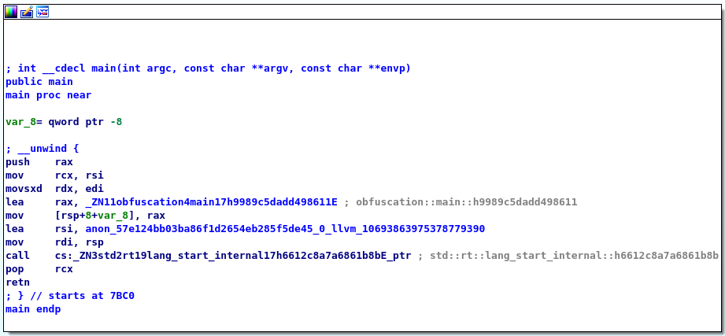

This document is a follow-up on the trends research, precisely on the topic of cross-platform malware. Since virtually everybody in the western world owns a smartphone
or a personal computer, the amount of different platforms that are running on our hardware is bigger than it ever was. This forces malware developers to spend much more
time on creating malware for each of these systems.

Nowadays, with the rise of new systems programming languages such as Rust or Go, developing malicious software for different platforms has become more accessible
and much quicker than it ever was.

## Research questions

Because portable software is a broad subject, I have decided to only focus on some key parts of the domain. My research will try to answer the following question,
along with the sub-questions:

**How does choosing Rust over C/C++ changes the malware development process and results?**

- Why would a malware developer choose Rust over C/C++?
- How does programming in Rust affect static analysis?
- How does Rust handle binary portability?

### Research strategies

In order to answer the sub-questions and produce the conclusion of the research I will combine different research strategies. This approach is going to allow me
to structurize my work and validate the quality of my research.

- **Why would a malware developer choose Rust over C?**

    This research questions will require the combination of Library, Workshop and Lab strategies. I will use Library to research what are the most important aspects of
    language used for malware development. Then, I am going to use that knowledge in the Workshop, to develop the software and validate it in the Lab. The results 
    from the Workshop are going to have the biggest impact on the answer of this research question.

- **How does programming in Rust affect static analysis?**

    Static analysis is a primary technique for dissecting and analysing malware samples. To research how Rust might change the the reverse engineering process, I will
    need to do some Library research on differences between Rust and C compilation process. Then I will take my findings to test in the Lab and the Workshop by reverse
    engineering a C program and its Rust counterpart. 

- **How does Rust handle binary portability?**

    Nowadays, with the rise of RaaS, malware developers try to target more and more systems. Therefore, I want to investigate whether and how Rust handles binary portability.
    To do that, I will use the previous research about Rust's compilation process and further extend it. Then I am going to do some hands-on testing to see if I can re-use
    my malware on different systems.

Having researched all the sub-questions I would be ready to produce the answer to the final question. To do that, I need to use the product of the research in the Lab
to see if and how does it work and then present it to my peers in the Workshop strategy.

## Why would a malware developer choose Rust over C/C++?

Malware development has always revolved around writing low-level code that interacts closely with a kernel of an OS. Linux kernel is written in C and Windows kernel in
C++. This means that majority of the malware developed throughout the years has been written in C or C++, since it allows for the best compatibility with native APIs.
According to _[Malpedia](https://malpedia.caad.fkie.fraunhofer.de/stats/linker_info)_, majority of viruses in their database are using MSVC linkers which suggests that
the software was written in languages from the C family, developed directly on Windows.

|  |
| Linkers used for compiling malware |

However, as of writing this document, the landscape begins to change. According to _[this article](https://www.zdnet.com/article/linus-torvalds-rust-will-go-into-linux-6-1/)_
and _[Rust for Linux](https://en.wikipedia.org/wiki/Rust_for_Linux)_ Wikipedia page, a pull request enabling Rust support has been merged into the kernel in October 2022.
This means that from Kernel v6.1, developers can officialy start writing drivers in Rust. Ultimately, this means that interoperability with C and other system internals
is going to become much better.

But why would a malware developer choose Rust over C? There are couple of the most prominent benefits:

- **Speed and memory safety**

    The Rust project has been started around a decade ago as a part of the Firefox browser. The language operates on lower level as C/C++ but has a different approach
    to some concepts that C-like languages were historically struggling with. There is no automatic garbage collection; instead, the lifetime of each variable is tracked
    during the compile-time. This approach can catch more memory corruption bugs during early stages of development.
    
    Moreover, Rust can compete with C/C++ in memory and speed benchmarks, while providing access to higher level programming concepts as closures, generics and collections
    as zero-cost abstractions.

- **Static analysis evasion**

    As stated before, majority of the malware in existence has been developed using C/C++. This means that for years, security researchers have used and developed software,
    that helps with analysing C/C++ binaries. However, Rust is not using a traditional compiler, but LLVM - a frontend, which provides a layer of abstraction beetwen the
    language and the machine. This benefits both regular and malware developers: the code is faster, and can be obfuscated more easily.

    It is significantly harder to statically analyze a Rust program since the compiler injects memory leakage checks into the binary during the compilation process. Resulting
    file is slightly bigger beacuse it contains much more machine code. This means that the readability of the executable is low in the first place and obfuscation introduces
    even more entropy into the file.
        
- **Cross-platform compatibility**

    The language was designed to work on _[multiple platforms](https://doc.rust-lang.org/nightly/rustc/platform-support.html)_ without rewriting the whole codebase or going
    through a complex compiling process (mainly thanks to LLVM). Moreover, Rust has quite good support for embedded devices, and it is possible to compile a program without
    the whole standard library. That makes the executable much smaller which is always desired by malware developers.
        
### Conclusions

Rust has some new approaches to common programming concepts which have been causing problems for many years. Because of that, and its low-level nature it seems like a great fit
for malware development: zero-cost abstractions for high-level concepts, speed on a C/C++, a compiler catching memory leaks in the development and a lot of freedom and flexibility
for creating viruses for different systems and devices.

This does not come without a cost - the learning curve is very steep in the beginning only to become more gradual after the initial barrier. This makes the first-time development
a long and cumbersome task. Also, the compile times can be very slow, especially for bigger projects, since the compiler is running a borrow checker which tracks a lifetime of every
variable in the program.

## How does programming in Rust affect static analysis?

There are two main types of malware analysis: dynamic and static. Dynamic analysis tries to inspect a malware sample by running it (usually in a sandboxed environment). The main
advantage of this approach is the ability to atatch a debugger to the process and to take a closer look at the program during the runtime. The static analysis however relies on
inspecting and reverse engineering the compiled executable without running it. This process can reveal execution flows and hidden data which would not be accesible during the 
runtime.

Therefore, apart from creating the logic for malware, the developers need to account for the fact that their software will be analysed by security researchers. This is not desired,
since the less is known about a malware, the higher the chance that it will sneak under AVs and will manage to infect more users. While avoiding dynamic analysis is more or less
 the same in C and in Rust, the biggest differences can be seen in the static analysis part of reverse engineering.

### Compilation process

LLVM is a set of compiler and toolchain technologies that can be used for developing programming languages. The main advantage of using LLVM comes from using it as a front-end
of the programming language. In essence, this means that LLVM performs code analysis and transforms it into an intermediate representation (IR), which makes the the Rust compiler,
in a way, platform agnostic.

A compilation process consists of these steps:

1. Lexical analysis
2. Parsing
3. Semantic analysis
4. Optimisation
5. Code generation

Lexical analysis creates so called `tokens` which are then processed by the parser to build abstract syntax tree (AST). At the parsing  stage, the compiler expands macros and de-sugars
the code. So the following instructions:

```rust
let arr = vec!["1", "2", "3"];

for num in arr {
    println!("{}", num);
}
```

are in reality a sugar coating for more elaborate statements.

```rust
// expansion of the vec! macro
let arr = <[_]>::into_vec(#[rustc_box] ::alloc::boxed::Box::new(["1", "2", "3"]));

// for loop is actually a syntax sugar for
// an infinite loop based on iterators
let mut iter = IntoIterator::into_iter(arr);
loop {
    match iter.next() { // match the next iterator
        Some(num) => {
            // expansion of the println! macro
            {
                ::std::io::_print(
                    ::core::fmt::Arguments::new_v1(
                        &["", "\n"],
                        &[::core::fmt::ArgumentV1::new_display(&num)],
                    ),
                );
            };
        },
        None => break, // break if 'empty'
    }
}
```

It's not important to understand what the code does, but rather to notice how much code was hidden by the syntactic sugar. It turns out that the for loop has a hidden conditional
flow. Morevoer, the `vec!` and `println!` macros are some handy shortcuts which hide elaborate statements. All of this is done to make it easier for the compiler to analyse the
code.

But how all of this relates to the static analysis?

### Obfuscating LLVM

After lexing and desugaring the code, the compiler enters the next stage - semantic analysis. This is one of the Rust's biggest strengths. The code is validated and the borrow 
checker tracks lifetime of each variable to catch any possible memory leaks. Then the compiler enters the optimisation and code generation stages. Because LLVM is language
agnostic, it requires the compiler to translate the code into an intermediate representation (IR). This IR is going to be processed by the LLVM: optimised and compiled on
the selected platform. And the IR is where the obfuscation comes into the picture.

`obfuscation/src/main.rs`

```rust
fn main() {
    let arr = vec!["1", "2", "3"];

    for num in arr {
        println!("{}", num);
    }
}
```

Compiling the program with `cargo build --release` and running the program is going to give us the following output.

```
$ cargo run --quiet
1
2
3
```

And the binary from the release build can be found at `obfuscation/target/release/`.

|  |
| Disassembled binary |

The graph and generated code is very straightforward. Even though the macros expanded to much more code, IR was optimised by LLVM and created a neat executable with very simple 
code flow.

[LLVM obfuscator]() is a plugin that can be used by `cargo`, the Rust compiler to obfuscate the code flow of the program in the compilation. That way, it is much easier to create
a unique binary every time it is compiled. Moreover, it makes static analysis much harder since some of the functions are there just to waste time of the researchers.

TODO: Add pictures of building and disassembly

To use the plugin I had to build LLVM and the plugin itself, and then create a custom Rust toolchain with the toolchain manager `rustc`. However, as depicted on the picture below
the effort paid off and a very crude and simple program became something much more complex.

|  |
| Obfuscated program |

### Conclusions

There is no other way of avoiding static analysis than increasing the entropy of the binary, adding pointless functions and trying to mislead the researcher as much as possible.
This is not a future-proof approach, as this is mainly 'security by obscurity'. However, this can buy time for hackers, and that is the most valuable resource - they can infect
bigger portions of the systems and extract more information.

What does it mean in the favor of Rust? Well, the executables contain a lot of machine code that is injected by the compiler to facilitate memory leak prevention, de-sugarizing
the code and expanding macros. This means that the binaries become much harder to analyse, coming from the C/C++ landscape. Moreover, with the obfuscation, the task becomes even
harder.

## Does Rust have native support on Windows/Linux?

Since Rust was created with portability in mind, one would expect the language to be have good support for interacting with the kernel/api of the OS. And indeed,
this is the case with the language. Development with Rust is quite straightforward on both Linux and Windows, but it requires a slightly different approach on each of the platforms.

### Linux

Unix-like systems follow the well known philosophy: 'Everything is a file'. Essentially, this means that almost all system internals are exposed as a stream of bytes
accessible through the OS' filesystem API. Since GNU/Linux was written mainly in C, the files representing system internals are C structures most of the time.

For example, the file which exposes keystroke events at `/dev/input/eventX` is in fact a stream of bytes which make up the the `input_event` struct. This is the original,
C version of the struct:

```c
struct input_event {
    struct timeval time;
    unsigned short type;
    unsigned short code;
    unsigned int value;
};
```

If a programming language would want to work with an input event, it would need to cast the bytes making up the struct into it's own binding of the C library. In Rust,
the official `libc` implementation defines this version of `input_event` struct:

```rust
pub struct input_event {
    pub time: ::timeval,
    pub type_: ::__u16,
    pub code: ::__u16,
    pub value: ::__s32,
}
```

As depicted, the Rust's version takes the same amount of memory as the C struct - 24 bytes on my computer. So in order to be able to use the `input_event` struct
in Rust, it needs to be transmuted from an _unsafe_ byte array to a _managed_ one, like that:

```rust
use libc::input_event;

// Get the size of the Rust's input_event struct
const EV_SIZE: usize = mem::size_of::<input_event>();
let mut buf: [u8; EV_SIZE] = unsafe { mem::zeroed() };

// Cast the C struct to empty array
let ev = unsafe { mem::transmute::<[u8; EV_SIZE], input_event>(buf) };
```

This approach requires a bit more knowledge from the programmer, but if somebody is going down into system internals they need to understand it in-depth. Moreover,
in case of some custom or not-yet-implemented C data types, the programmer has freedom to create their own bindings for the said structures.

Below, you can take a look at a small demo. The keylogger is intercepting and printing out my keystrokes.



### Windows

## How does Rust handle binary portability/cross-platform compiling?
