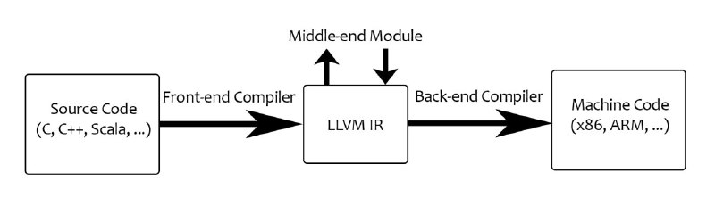
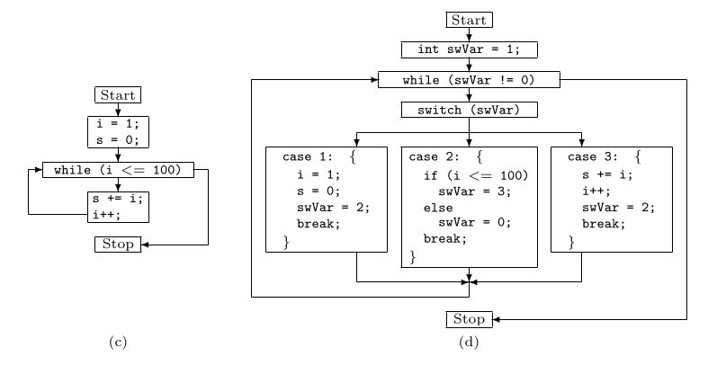
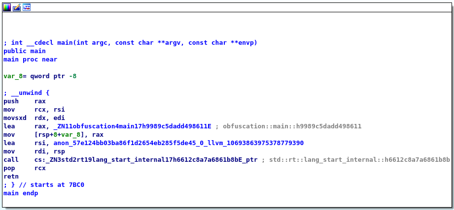

While developing malware, you will probably need to somehow make your binaries harder to reverse engineer. That way, your programs might be able to live in the victim's
system for much longer unnoticed. But how can that be achieved? Well historically, it usually boiled down to encrypting or splitting strings in the code so that this:

```c
normal code
```

becomes this:

```c
code with split strings
```

As you can see, this makes a program a bit harder to understand while developing. And this is just the top of the iceberg - when introducing more complex ideas as changing
the control flow of the program, the readability of the code degrades and the effort is just not worth it. But there must be a better way, right?

### Optimizing the compilation process

Right now, people have been mostly obfuscating their programs in a _caveman_ style. However, there are tools that could automate and streamline the obfuscation process. 
Or at least make it much easier for the developers.

Let's take a step aside and look at the traditional compilation process. The compilers usually start with code analysis which looks like this:

1. Perform a lexical analysis and create 'symbols' of the code. Then build an Abstract Syntax Tree (AST) using the 'symbols'
2. Perform a semantic analysis on the AST and verify whether the statements make sense or not
3. Optimize the AST
4. Generate machine instructions for the host CPU

In most compilers the 3rd and 4th step are tightly coupled - When the AST is optimized, the compiler will then proceed to generate instructions for the machine it is running on.
A slightly more flexible idea of compilation is utilized by **LLVM** - a set of compiler and toolchain technologies that allows developers to create programming langauges that
are platform agnostic. Furthermore LLVM accepts modules that can process an abstract assembly language - Intermediate Representation (IR).

|  |
| LLVM Optimization Pipeline |

However this optimization can also be used for implementing some automated obfuscation techniques, so that the readability of the code persists and only the machine instructions
are being altered.

### Out of tree pass development

However, before I will explain how obfuscation process can be streamlined with LLVM. I need to make a detour to talk about an interesting way of making the compiled code more
incomprehensible for the reverse engineers. Control flow flattening breaks up a programs structure into basic blocks - sets of instructions with only one entry and exit point. Then these instructions are taken from different nesting levels and placed next to each other. Take this basic program as an example:

```c
int i = 0;

while (i < 100) 
{
    important_function();
    i++;
}
```

And this is how it might look like when control flow flattening was applied

```c
int i = 0;
int swFlag = 1; // create a switch flag

while (swFlag != 0) 
{
    switch (swFlag)
    {
        case 1:
            i = 1;

            swFlag = 2;
            break;
        case 2:
            if (i <= 100)
                swFlag = 3;
            else
                swFlag = 0;

            break;
        case 3:
            important_function();
            i++;

            swVar = 2;
            break;
    }
}
```

These two pieces of code accomplish the same task! They are however much more different in how they perform it. Therefore the program's structure is going to differ.

// TODO: CHANGE PIC

|  |
| Control flow flattening |

[This paper](https://www.inf.u-szeged.hu/~akiss/pub/fulltext/laszlo2007obfuscating.pdf) explains control flow flattenning in depth, dealing with  more complex concepts like the
`try ... catch` and `switch` clauses, as well as proposes an algorithm which  could obfuscate  the binary during the compile time. Since this is a task which can be performed 
during the compile time, the algorithm needs to be implemented in a compiler. This means that control flow flattening can be well applied to LLVM as a plugin.

### Obfuscating LLVM

After lexing and desugaring the code, the compiler enters the next stage - semantic analysis. This is one of the Rust’s biggest strengths. The code is validated and the borrow 
checker tracks lifetime of each variable to catch any possible memory leaks. Then the compiler enters the optimisation and code generation stages. Because LLVM is language
agnostic, it requires the compiler to translate the code into an intermediate representation (IR). This IR is going to be processed by the LLVM, optimised and compiled on
the selected platform. And the IR is where the obfuscation takes place.

`obfuscation/src/main.rs`

```rust
fn main() {
    let arr = vec!["1", "2", "3"];

    for num in arr {
        println!("{}", num);
    }
}
```

Compiling the program with `cargo build --release` and running the program is going to give us the following output.

```
$ cargo run --quiet
1
2
3
```

And the binary from the release build can be found at `obfuscation/target/release/`.

|  |
| Disassembled binary |

The graph and generated code is very straightforward. Even though the macros expanded to much more code, IR was optimised by LLVM and created a neat executable with very simple 
code flow.

[LLVM obfuscator]() is a plugin that can be used by `cargo`, the Rust compiler to obfuscate the code flow of the program in the compilation. That way, it is much easier to create
a unique binary every time it is compiled. Moreover, it makes static analysis much harder since some of the functions are there just to waste time of the researchers.

_TODO: Add pictures of building and disassembly_

To use the plugin I had to build LLVM and the plugin itself, and then create a custom Rust toolchain with the toolchain manager `rustc`. However, as depicted on the picture below
the effort paid off and a very crude and simple program became something much more complex.

|  |
| Obfuscated program |
