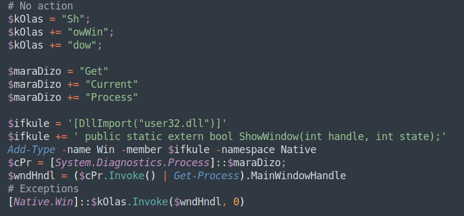

**Disclaimer**: this article does not talk about a lot of boilerplate code/knowledge required to start developing plugins for LLVM system.
[My repository](https://github.com/malpa222/llvm-obfuscation) is a good start for playing around with the tools. If you want to dive deeper into the infrastructure
take a look at resources provided in the references section.

- A clone of [this repository](https://github.com/malpa222/llvm-obfuscation). Keep this repo at hand because I am going to refer to certain files in the article.
- C/C++ compiler (preferably clang because we want to take a look at LLVM's intermediate representation)
- CMake and a build tool (preferably ninja) for building the project
- LLVM and opt for loading our plugins
- llc for compiling LLVM's byte code

## Why obfuscate?

While developing malware, you will probably need to somehow make your binaries harder to reverse engineer. That way, your programs might be able to live in the victim's
system for much longer unnoticed. But how can that be achieved? Well historically, it usually boiled down to encrypting or splitting strings in the code. This makes a program
a bit harder to understand while developing. And this is just the top of the iceberg - when introducing more complex ideas as changing the control flow of the program, the readability of the code degrades and the effort is just not worth it. But there must be a better way, right?

## Optimizing the compilation process

Until recently, people have been mostly obfuscating their programs in a _caveman_ style. They would for example split up command strings into multiple variables, or
manually try to alter the flow of the program. But that just made the code hard to read, write and maintain, but not necessarily harder to reverse engineer. Take a
look at PowerShell script from a [BumbleBee malware dropper](https://www.deepinstinct.com/blog/the-dark-side-of-bumblebee-malware-loader):

|  |
| Manual obfuscation |

The language is not the important thing in this example. It's rather the readability and maintainability of the code. Luckily, there are tools that could automate
and streamline the obfuscation process. Or at least make it much easier for the developers.

Let's take a step aside and look at the traditional compilation process. The compilers usually start with code analysis which looks like this:

1. Perform a lexical analysis and create 'symbols' of the code. Then build an Abstract Syntax Tree (AST) using the 'symbols'
2. Perform a semantic analysis on the AST and verify whether the statements make sense or not
3. Optimize the AST
4. Generate machine instructions for the host CPU

In most compilers the 3rd and 4th step are tightly coupled - When the AST is optimized, the compiler will then proceed to generate instructions for the machine it is running on.
A slightly more flexible idea of compilation is utilized by **LLVM** - a set of compiler and toolchain technologies that allows developers to create programming languages that
are platform agnostic. Furthermore LLVM accepts modules that can process an abstract assembly language - Intermediate Representation (**IR**).

|  |
| LLVM Optimization Pipeline |

However this optimization can also be used for implementing some automated obfuscation techniques, so that the readability of the code persists and only the machine instructions
are being altered.

### Developing plugins for LLVM

Let's take a look on how to implement a simple pass (yet another name for a plugin in the LLVM lingo). The pass is going to transform the IR and substitute instructions
to make them a bit more annoying to reverse engineer. We will test our pass on a very simple LLVM IR. The code in `examples/start.ll` defines two functions that either
`add` or `sub` provided parameters and return the outcome.

```llvm
define i32 @add(i32 %a, i32 %b) {
  %c = add i32 %a, %b
  ret i32 %c
}

define i32 @sub(i32 %a, i32 %b) {
  %c = sub i32 %a, %b
  ret i32 %c
}
```

First, let's take a look at the analysis plugin in `lib/Substitution.cpp`. The plugin will loop through basic blocks of the IR code and look for certain patterns/instructions.
In our case it will be `add` and `sub` instructions. The plugin is going to return a set of instructions that will be later changed by another plugin.

```cpp
SubstitutionAnalysis::Result SubstitutionAnalysis::run(Function &F, FunctionAnalysisManager &FAM) {
    SmallVector<BinaryOperator*, 0> Insts;

    for (inst_iterator I = inst_begin(F), E = inst_end(F); I != E; I++) {
        if (!I->isBinaryOp()) // check if instruction adds two numbers of the same type
            continue;

        // check if the instruction is either add or sub
        if (auto opcode = I->getOpcode(); opcode == Instruction::Add || opcode == Instruction::Sub)
            Insts.push_back(cast<BinaryOperator>(&*I)); // save the instruction
    }

    return Insts;
}
```

The `SubstitutionPass::run()` method in `lib/Substitution.cpp` will transform the intermediate representation and substitute the addition and subtraction instructions. These two
functions are going to accept an instruction in the form of a binary operator and then proceed to change it.

For addition, we want `a + b` to look like `a - (-b)`

```cpp
// add i32 %a %b

void ReplaceAddInst(BinaryOperator *BO) {
  // create negation of %b
  // sub i32 0, %b
  auto op = BinaryOperator::CreateNeg(
          BO->getOperand(1),
          "",
          BO);

  // create new subtraction instruction
  // subtracting negated %b from %a
  auto sub = BinaryOperator::Create(
          Instruction::Sub,
          BO->getOperand(0),
          op,
          "",
          BO);

  // replace the old instruction and remove it
  BO->replaceAllUsesWith(sub);
  BO->eraseFromParent();
}
```

The function is then called in the `SubstitutionPass::run()` in `lib/Substitution.cpp` which will transform the IR into a new one.

### Compile, load and run

Now the next step would be to validate the code that we wrote. In the root of the project run:

```bash
mkdir -p build; \
 cmake -G Ninja -DLT_LLVM_INSTALL_DIR=$(whereis llvm) -S . -B build/; \
 ninja -C build -j$(nproc)
```

There should be a file called `build/lib/libSubstitution.so` (or \*.dll, or \*.dylib. Depends on the system that you are using.
I wrote this article on/for linux). This is a shared object or a library that will be loaded into LLVM's plugin manager - **opt**

Let's load the pass into the plugin manager and run it on the `examples/start.ll` to see how it works in practice.

```bash
opt -load-pass-plugin=build/lib/libSubstitution.so \
 -passes=sub -S examples/start.ll \
 -o /tmp/start.ll
```

We can see that `/tmp/start.ll` is slightly different from the original `examples/start.ll`

```llvm
; ModuleID = 'examples/start.ll'
source_filename = "examples/start.ll"

define i32 @add(i32 %a, i32 %b) {
  %1 = sub i32 0, %b
  %2 = sub i32 %a, %1
  ret i32 %2
}

define i32 @sub(i32 %a, i32 %b) {
  %1 = sub i32 0, %b
  %2 = add i32 %a, %1
  ret i32 %2
}
```

Apart from changed variable names and some comments, the addition and subtraction instructions were replaced with the code that we used in the transformation pass. So it
works on a simple IR. Neat!

## Trying it out with clang

Let's try it on a real world example and run it on an actual C program that will be compiled with clang.

```c
int add(int a, int b) {
    return a + b;
}

int sub(int a, int b) {
    return a - b;
}

int main() {
    int a = add(5, 10);
    int b = sub(10, 5);
    int c = a - b;

    return 0;
}
```

We can transform it to human-readable LLVM IR with the following command. Notice the `-Xclang -disable-O0-optnone -O0` arguments. They prevent the compiler from disabling
optimization on our functions. That's because we are using a pre-compiled binary. In real life, one would rather compile their own instance of clang and
configure it to their own needs.

```bash
clang -Xclang -disable-O0-optnone -O0 \
 -S -emit-llvm examples/hello.c \
 -o /tmp/hello.ll
```

Because the function is not optimized yet, the `add` function is transformed into something more complex by the compiler. The majority of the instructions in the following
code block allocate the variables on stack and then retrieve them to perform the addition. We are mainly interested in the last two lines - assignment to `%7` and the `ret`
statement. The `nsw` flag in the `add` instruction tells the compiler that the addition might result in an integer overflow.

```llvm
; Function Attrs: noinline nounwind uwtable
define dso_local i32 @add(i32 noundef %0, i32 noundef %1) #0 {
  %3 = alloca i32, align 4
  %4 = alloca i32, align 4
  store i32 %0, ptr %3, align 4
  store i32 %1, ptr %4, align 4
  %5 = load i32, ptr %3, align 4
  %6 = load i32, ptr %4, align 4
  %7 = add nsw i32 %5, %6
  ret i32 %7
}
```

And now, when we run our optimization pass on the `.ll` file, using

```bash
opt -load-pass-plugin=build/lib/libSubstitution.so \
 -passes=sub -S examples/hello.ll \
 -o /tmp/t_hello.ll
```

the IR is going to look like this:

```llvm
; Function Attrs: noinline nounwind uwtable
define dso_local i32 @add(i32 noundef %0, i32 noundef %1) #0 {
  %3 = alloca i32, align 4
  %4 = alloca i32, align 4
  store i32 %0, ptr %3, align 4
  store i32 %1, ptr %4, align 4
  %5 = load i32, ptr %3, align 4
  %6 = load i32, ptr %4, align 4
  %7 = sub i32 0, %6
  %8 = sub i32 %5, %7
  ret i32 %8
}
```

As you can see, the addition instructions were substituted with our custom ones. This means that our plugin successfully ran on the real IR and transformed
the addition operations to a subtraction of the negation of the second operand.

## Compilation

Because this instruction substitution changes the code in a very minor and predictable way, the compiler is going to just optimize our changes. For example,
this is a disassembly of the `add` function from the C program we transformed earlier:

|  |
| Disassembly |

I used the following commands to compile the IR to machine code instructions. The disassembled `add` function is depicted on the picture:

```bash
llc -filetype=obj /tmp/t_hello.ll -o /tmp/hello.o; \
clang /tmp/hello.o -o /tmp/hello
```

|  |
| Disassembly of the transformed function |

As you can see, this code:

```nasm
mov eax, [rbp+var_4] ; move a to eax
add eax, [rbp+var_8] ; add b to eax
```

Was optimized by the compiler into one instruction:

```nasm
lea eax, [rdi+rsi] ; load outcome of a+b into eax
```

### Possibilities and conclusions

As mentioned earlier, this is just the tip of the iceberg. There are more complex obfuscation that are less predictable than instruction substitution, for example
control flow flattening. [This paper](http://ac.inf.elte.hu/Vol_030_2009/003.pdf) describes the concept in depth, but in essence - a program is broken down into multiple
blocks which are then shuffled around to fool the reverse engineer.

Because of the modularity of the LLVM compiler, with few hours of work, developers can create a flexible and testable framework for securing their programs instead of
resorting to very crude ways of code obfuscation. That would greatly improve the speed of the development and maintainability of the code.
