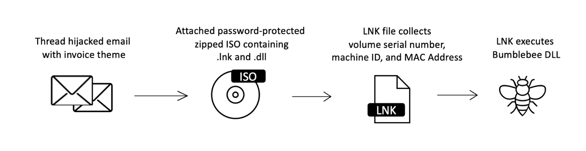
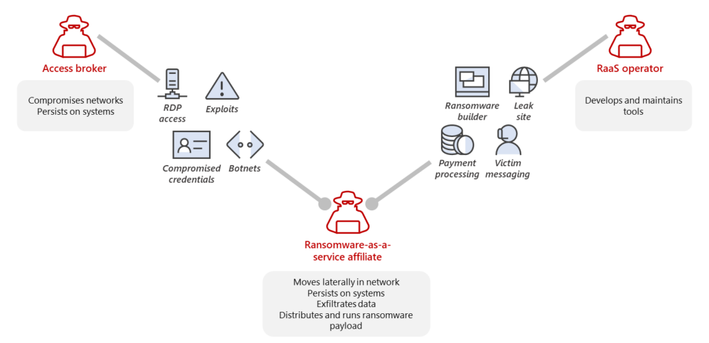
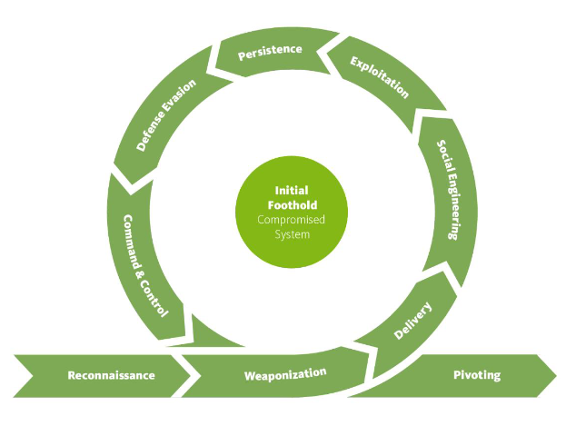
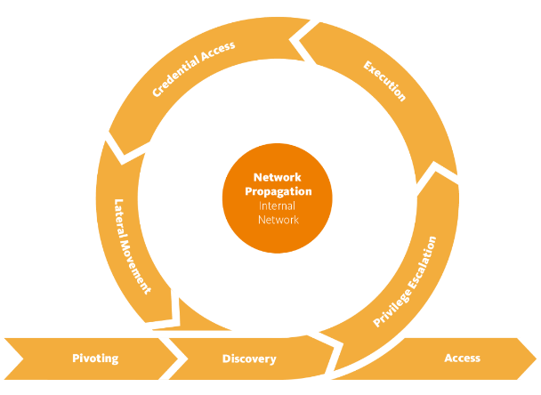
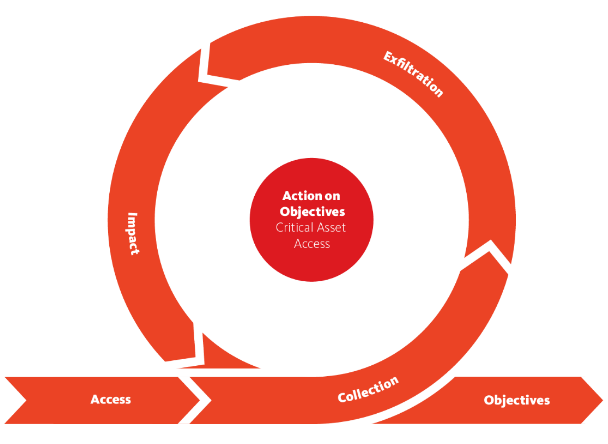
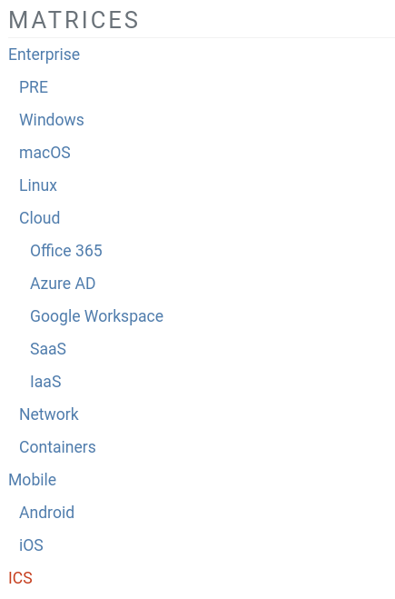
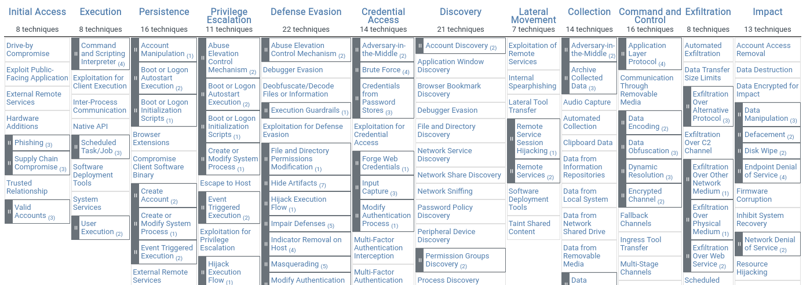

## What is a trend?

To me, a trend is a generic term, which can describe the things that are on the mouths of people or the current preferences/commodidities that a
certain group sticks to. However, in the cybersecurity context, trends can be defined as the directions in which the industry is developing,
new attack techniques, exploits on new (and old) technologies as well as the legal aspects of hacking. Therefore, I have decided to inquire
into different hacker 'groups', malware aggregators and cybersecurity reports to see which things are receiving more
traction in the red teaming world.

## Research questions

It is hard to create main research questsion for this document, since it focuses on exploring different trends and not trying to achieve a 'common goal'.
Nevertheless, my research needs a direction, therefore I have decided to write down the research questions that I want to follow while conducting the
investigation.

1. What kind of malware is on the rise right now?
2. What standards and methodologies are used in the red-teaming world?

## What kind of malware is on the rise right now?

According to a _[Mid-year update](https://www.sonicwall.com/medialibrary/en/white-paper/mid-year-2022-cyber-threat-report.pdf)_ conducted by Sonicwall,
in the first half of 2022, there has been a 11% increase in malware-related incidents compared to last year. Moreover, according to the company, the
increase in malware is real - there is more malware, because the number of attacks increased. The company explains that with the increase of on-site work,
the number of malware incident increases and when there is more offsite work, the numbers drop. However, when the offsite work ratio increased, the
malware incidents didn't decrease.

In order to look for recent malware discoveries I have turned to websites such as _[VX-Underground](https://vx-underground.org)_ and
_[Malpedia](https://malpedia.caad.fkie.fraunhofer.de)_. Both websites are databases containing malware examples, source code and research papers
on different topics regarding red teaming (as well as sytem hardening). The websites are being often updated with new discoveries, therefore I
have decided to use them as my sources for providing examples of recent attacks.

### Malware loaders - Bumblebee

In march a new malware loader was discovered. The code was named 'BumbleBee', after an user agent string that the malware used to contact the command
and control center. The discovery was made after a malware spread in a spear-phishing email campaign. The following graph shows an example of BumbleBee delivery

|  |
| BumbleBee delivery graph |

In late August, a new attempt to deliver malware was prevented. The detailed description can be found on Deep Instinct's
_[website](https://www.deepinstinct.com/blog/the-dark-side-of-bumblebee-malware-loader)_. The malware delivery chain forces user
to extract a _.zip_ archive, thus the _.iso_ file is mounted on victim's machine. The disk image contains a _.dll_ with payload and
a _.lnk_ file which opens a PowerShell script. To ensure stealthy execution of the payload, the PowerShell script uses multiple evasion techniques, such as:

- It breaks up command strings, to obfuscate code and evade static analysis. An excerpt from the malware PS script:

```
	$maraDizo = "Get";
	$maraDizo += "Current";
	$maraDizo += "Process";

	# I skipped some code

	$cPr = [System.Diagnostics.Process]::$maraDizo;
```

- BumbleBee proactively checks for a virtual/sandboxed environment and tries to prevent analysis. It was found to have been using
  _[al-khaser](https://github.com/LordNoteworthy/al-khaser)_ - an open-source project containing a plethora of different tools that check whether
  the malware is running in a VM, has a debugger attached, is being analysed etc.

According to Bleeping Computer, the malware is still in development and becomes more and more sophisticated with each update - for example, recent
versions, found in September,
_[load the payload directly into memory](https://www.bleepingcomputer.com/news/security/bumblebee-malware-adds-post-exploitation-tool-for-stealthy-infections/)_,
reducing detection possibilities even more.

### Ransomware as a Service

In the middle of may 2021, A hacker group _REvil_ launched an attack on several US businesses using a Ransomware as a Service model.
According to _[Bleeping Computer](https://www.bleepingcomputer.com/news/security/sodinokibi-ransomware-following-the-affiliate-money-trail/)_,
the hackers would recruit affiliates and use them to distribute ransomware.

|  |
| RaaS affiliate model |

The economy in cybercrime world is constantly evolving to allow attackers with lower level of technical skill to achieve the same results as if they
were up to par with other, more experienced actors. This is possible by creating a net of acess brokers, operators and affiliates - as shown on the diagram above.
This allows the ransomware operators to be focused on the ransomware development, keeping them relatively under the radar.

#### Getting access

_[According to Microsoft](https://www.microsoft.com/security/blog/2022/05/09/ransomware-as-a-service-understanding-the-cybercrime-gig-economy-and-how-to-protect-yourself/#ransomware-as-a-sevice-incidents)_
, access brokers actively scan the internet in order to find vulnerable/misconfigured systems that could serve as botnet. This network would be 'asleep' until
an access is needed. With the help of malware droppers such as BumbleBee, access brokers can convienently sell the entry to their clients.

#### BlackCat

In December 2021, a new threat actor identifiying themselves as BlackCat, started advertising their RaaS services on Russian underground forums. Their modus operandi
initiated a massive shift in the ransomware development world. The malware was written in Rust, which allowed the attackers to simultaneously create samples for
Windows and Linux.

_[Kaspersky labs noticed](https://go.kaspersky.com/rs/802-IJN-240/images/TR_BlackCat_Report.pdf)_ that BlackCat members have re-used an existing exfiltration
malware _Fendr_, to gather data about their victims. According to the raport, the group has modified _Fendr_ to adapt it to their needs, which shows that BlackCat
is made up from experienced developers.

## What standards and methodologies are used in red-teaming by cybersecurity companies?

Even though every organisation is different, hackers tend to use the same strategies to conduct attacks on companies. Computer networks, servers
and whole systems are structured in a similar way, which forces attackers to use similar techniques. Therefore, cybersecurity companies created
frameworks for identifiying the attacks, their stages and the techniquest that hackers used/are going to use.

### Unified killchain

Unified killchain is a framework that aims to provide an insight into the tactics that hackers use to reach their objectives. According to
_[unifiedkillchain.com](https://www.unifiedkillchain.com/)_, this model divides a cyberattack into three stages, which can be iterated on.
Not every attack is linear, and with more secure networks or multiple goals, hacker might need to redo the same stage multiple times.

#### First stage: Initial foothold

This is the beginning stage of every attack. Usually, the target goals are only accessible from within the organisational's network, so hackers need
to gain an entry point. It starts with an initial reconnaissance which allows the cybercriminals to prepare their toolset and tactics accordingly.

|  |
| Initial foothold stage |

When their tools are prepared, hackers will attempt to enter the network by means of phishing, social engineering or exploiting vulnerabilities
in the network. Having gained access, the hackers will try to establish connnection to their Command and Control servers to ensure persistence on the network,
while evading defensive systems at the same time.

#### Second stage: Network propagation

After getting that initial foothold into victim's infrastructure, attackers will start gathering information about the compromised system, the network and
the data that they can access with current privileges.

|  |
| Network propagation stage |

The attackers will usually start this phase by gaining as much information as possible by pivoting through the network and discovering different services and
assets. The goal behind this is to find vulnerable points in the system which could allow the for privilege escalation. With higher privileges, attackers
might be able to execute code to extract user credentials from the memory of the remote system.

With an access to credentials that might have control over other systems, attackers will start another iteration of this phase until they discover
where their target is stored and have enough priviliges to access it.

#### Third stage: Action on objectives

After the attackers have gained enough priviliges to access the desired assets, they will try to violate confidentiality, integrity or availability of the
resourcers. Usually the attackers might try to exfiltrate the data to their systems or to encrypt the organisational network and issue a ransom demand.

|  |
| Action on objectives |

Unified killchain is a tool which can help organisations with understanding how an attacker might approach their system. When an organisation has
conducted a risk analysis, it will know which assets the attackers might be after, or what other motives they might have. With this knowledge and help of
cyber killchain, an organisation will be much more prepared for a cyberattack and the aftermath.

### Mitre ATT&CK

_[In around 2013](https://medium.com/mitre-attack/att-ck-101-17074d3bc62)_, Mitre has started working on a framework which would allow them to
create a map of commmon techniques used by attackers. The goal behind that was to create a comprehensible dataset which could be divided into
different systems and attacker goals. The framework introduces key concepts:

1. Tactics - Represent the reason behing the attackers actions, the tactical goal. For example, hacker would escalate priviliges on a system.
2. Techniques - This represents **how** an attacker would achieve this. For example, by exploiting Active Directory.
3. Sub-techniques - The lower level of _techniques_. An attacker would issue a fake Administrator certificate within AD.
4. Procedures - Procedures describe the specific implementation of sub-techniques. For example, that the hacker would inject a PowerShell script
   into a privilieged process to issue a fake call to the AD services.

#### Matrices

To group techniques by the goals they are trying to achieve, ATT&CK uses several matrices and categories. The main categories are Enterprise, Cloud and ICS
(industrial control systems). Then, each of the categories has multiple subcategories, as shown below.

|  |
| Matrices |

These higher-level matrices consist of smaller matrices that contain techniques, sub-techniques and procedures. This framework is very useful in addition to the
unified killchain described eariler. When combining both models an organisation might define the high-level approach that hackers might use to achieve their goals,
as well as which techniques they are going to use to reach their strategical goals.

|  |
| Windows ATT&CK matrix |
